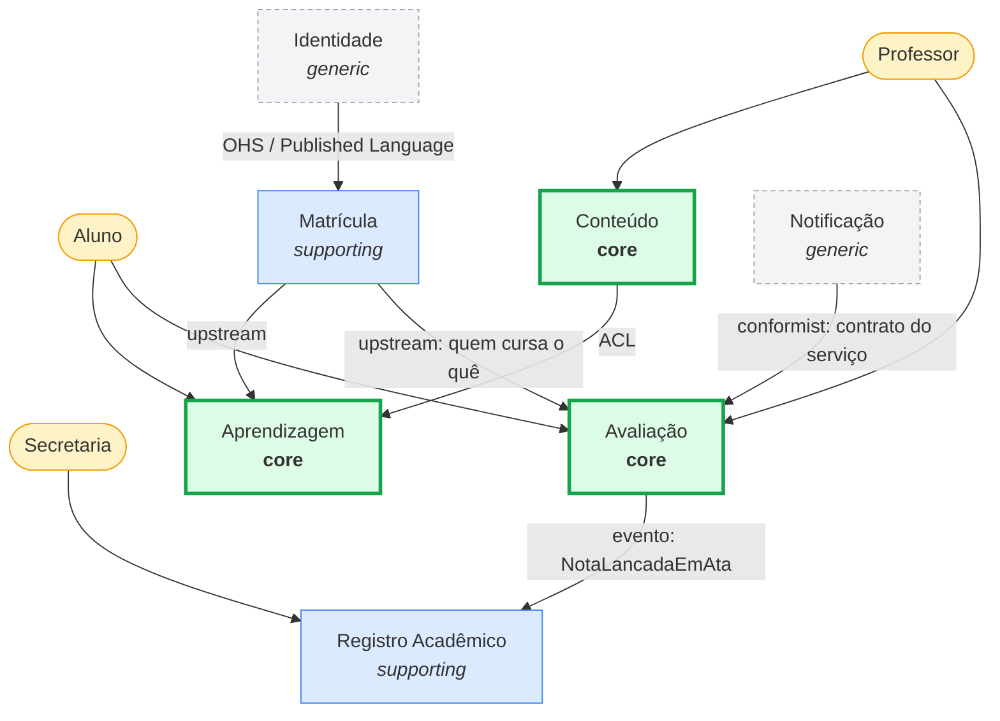

## 1. Stakeholders e requisitos

| Stakeholder | Requisito principal |
|---|---|
| Aluno | Consultar notas e conteúdo com baixa latência |
| Professor | Avaliar com rastreabilidade da nota |
| Secretaria | Histórico oficial íntegro, com valor legal |
| Coordenação | Relatórios consolidados e confiáveis |
| Equipe de TI | Módulos implantáveis de forma independente |

O conflito que orienta todo o desenho está entre as duas primeiras linhas: para o aluno a
nota precisa aparecer **rápido**; para a secretaria ela precisa ser **imutável**. As duas
exigências puxam a arquitetura em direções opostas, e é isso que justifica separar contextos
em vez de manter um modelo único.

## 2. Classificação de domínios

| Domínio | Tipo | Justificativa |
|---|---|---|
| Avaliação e Aprendizagem | **Core** | Razão de ser do LMS; a regra de média e aprovação é própria da instituição |
| Entrega de Conteúdo | **Core** | A experiência de aula é o produto percebido pelo aluno |
| Registro Acadêmico | Supporting | Documento oficial, com regras próprias, mas padronizado pelo setor |
| Gestão Acadêmica (matrícula) | Supporting | Necessário ao core, sem diferencial competitivo |
| Comunicação (fórum, avisos) | Supporting | Sustenta engajamento; regras simples |
| Relatórios e BI | Supporting | Alto valor gerencial, baixo diferencial técnico |
| Identidade e Acesso | Generic | Problema resolvido: usar provedor OIDC |
| Notificação | Generic | Serviço de mercado |

A consequência prática é de alocação: **o time mais forte vai para o core**. Construir
autenticação do zero enquanto o cálculo de média está mal modelado é erro de priorização.

## 3. Mapa de contexto

A seta de **Notificação** aponta para Avaliação porque *conformist* descreve quem se
submete ao contrato de quem: é Avaliação que se adapta ao formato ditado pelo serviço
externo, e não o contrário.

## 4. Os contextos, em uma linha cada

| Contexto | Responsabilidade | Linguagem ubíqua |
|---|---|---|
| **Avaliação** | Registrar avaliações, calcular média e situação | Avaliação, Rubrica, Tentativa, Situação |
| **Aprendizagem** | Trilha, progresso, conclusão de módulo | Trilha, Módulo, Progresso, Conclusão |
| **Conteúdo** | Vídeos e materiais, versão e publicação | Recurso, Versão, Publicação |
| **Registro Acadêmico** | Histórico oficial e documentos com valor legal | Histórico, Ata, Lançamento, Certificado |
| **Matrícula** | Vínculo aluno–turma–período | Matrícula, Turma, Período, Vaga |
| **Identidade** | Autenticação e perfis | Usuário, Papel, Sessão |
| **Notificação** | Entrega de avisos por canal | Canal, Template, Entrega |

*Comunicação* e *Relatórios e BI*, classificados na seção 2, não aparecem no mapa por
simplicidade de leitura: ambos são consumidores de eventos e não alteram as fronteiras
discutidas aqui.

## 5. Justificativa das decisões

**Avaliação separada de Registro Acadêmico.** É a fronteira mais importante, e vem de uma
divergência real de regra de mudança. Em Avaliação a nota é mutável — o professor corrige, o
aluno recupera. Em Registro ela é um fato consumado: uma correção não sobrescreve, gera novo
lançamento com justificativa, porque o documento tem valor legal. Unir os dois obrigaria o
mesmo agregado a ser simultaneamente editável e imutável, produzindo flags de estado e
regras condicionais espalhadas — o sintoma clássico de fronteira mal traçada. Separando, a
passagem vira um evento explícito: `NotaLancadaEmAta`.

**Conteúdo separado de Aprendizagem.** Conteúdo trata do *artefato* — um vídeo tem versão,
formato, direitos de uso. Aprendizagem trata do *percurso* — o aluno assistiu, progrediu,
concluiu. O mesmo vídeo participa de várias trilhas, e a trilha sobrevive à substituição do
vídeo. Ciclos de vida independentes.

**Anticorruption Layer entre Conteúdo e Aprendizagem.** Sem ela, conceitos como codec e
transcodificação vazariam para dentro do domínio de progresso do aluno, que não tem nada a
ver com isso.

**Identidade como Open Host Service.** Contrato estável e padronizado (OIDC), com muitos
consumidores e nenhum negociando formato — o caso exato em que publicar uma linguagem
comum é melhor que integrar par a par.

**Efeito em escalabilidade e manutenibilidade.** Fronteira boa não é a que separa mais, é a
que faz a mudança **parar de se propagar**: alterar a regra de arredondamento da média fica
contido em Avaliação, sem alcançar histórico, relatórios e certificados. E como consulta de
nota e emissão de histórico têm perfis de carga opostos — alta e em rajada contra rara e
pesada — cada contexto escala no seu ritmo, com cache e réplicas de um lado e consistência
transacional forte do outro.

A ressalva devida: contexto delimitado custa tradução entre modelos e consistência
eventual. Aplicá-lo a um sistema pequeno é complexidade sem retorno. O critério é a
existência de divergência real de linguagem ou de regra de mudança — que no Prometheus
existe, e está documentada acima.

## 6. Referências

- Evans, E. *Domain-Driven Design*. Addison-Wesley.
- Vernon, V. *Implementing Domain-Driven Design*. Addison-Wesley — Context Mapping.
- Khononov, V. *Learning Domain-Driven Design*. O'Reilly — classificação de subdomínios.
- Material da semana: Módulo 7 — Análise de negócio e DDD.
