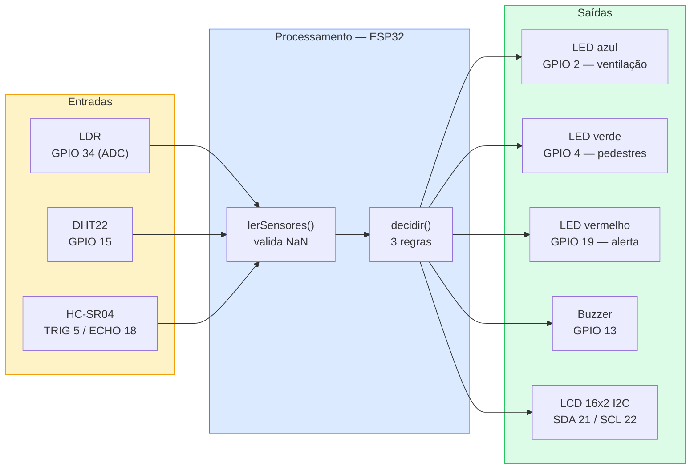
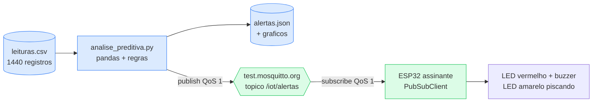

## 1. Objetivo

Projetar um sistema embarcado que interprete condições ambientais simuladas e acione
respostas automatizadas com visualização, seguindo princípios de projeto seguro e
escalável.

O protótipo foi construído no **Wokwi** com um **ESP32**, três sensores e quatro
atuadores, implementando três regras de automação urbana e exibindo estado em LCD e no
monitor serial.

---

# Atividade #1 — Protótipo de automação contextual de cidade inteligente

## 2. Diagrama do sistema



### 2.1. Mapa de pinos

| Componente | GPIO | Observação |
|---|---|---|
| LDR (analógico) | 34 | ADC1, pino *input-only* — correto para leitura analógica |
| DHT22 | 15 | Digital de uma via |
| HC-SR04 TRIG / ECHO | 5 / 18 | Alimentado em 5 V |
| LED azul (ventilação) | 2 | Com resistor de 220 Ω |
| LED verde (pedestres) | 4 | Com resistor de 220 Ω |
| LED vermelho (alerta) | 19 | Com resistor de 220 Ω |
| Buzzer | 13 | — |
| LCD 16x2 I2C | 21 (SDA) / 22 (SCL) | Endereço 0x27 |

O buzzer ficou no GPIO 13, e não no 21, por um motivo concreto: **21 e 22 são os pinos I2C
padrão do ESP32**. Usar o 21 para o buzzer faria o LCD e o buzzer disputarem o mesmo pino, e
a falha apareceria como um display mudo e intermitente — sintoma difícil de associar à
causa. O ADC ficou no 34 porque os pinos do ADC2 são usados pelo rádio Wi-Fi e param de
responder quando o Wi-Fi liga.

## 3. Lógica de controle

A decisão foi isolada numa função pura, `decidir()`, que **não lê sensor nem aciona pino**
— apenas recebe leituras e devolve ações. Essa separação é o que torna a lógica testável e
permite alterar regras sem tocar no hardware.

```cpp
Acoes decidir(const Leitura& l) {
  Acoes a = { false, false, false, "NORMAL" };

  if (!l.valida) { a.estado = "ERRO SENSOR"; return a; }

  // Regra 1 - anoitecer com calor
  if (l.luz < LIMIAR_LUZ_BAIXA && l.temperatura > LIMIAR_TEMP_ALTA) {
    a.ventilacao = true; a.pedestres = true; a.estado = "NOITE QUENTE";
  }

  // Regra 2 - obstaculo proximo
  if (l.distancia < LIMIAR_DIST_PERIGO) {
    a.alerta = true; a.estado = "OBSTACULO";
  }

  // Regra 3 - calor seco, tem precedencia
  if (l.temperatura > LIMIAR_TEMP_CRITICA && l.umidade < LIMIAR_UMID_BAIXA) {
    a.alerta = true; a.ventilacao = true; a.estado = "ALERTA SECA";
  }

  return a;
}
```

Três decisões merecem registro:

**Ordem das regras define precedência.** As regras não são exclusivas — podem valer ao
mesmo tempo. Como a regra 3 é a mais grave, ela é avaliada por último e sobrescreve o
rótulo de estado. Os LEDs, por serem acumulativos, permanecem acesos por qualquer regra que
os acione.

**NaN é tratado explicitamente.** O DHT22 devolve `NaN` quando a leitura falha. Se esse
valor entrasse nas comparações, toda condição viraria falsa silenciosamente e o sistema
pareceria estar em estado normal com o sensor quebrado. Por isso a flag `valida` e o estado
`ERRO SENSOR`.

**O laço não bloqueia.** O ciclo usa comparação com `millis()` em vez de `delay()`, e o
intervalo é de 2 s porque o DHT22 não aceita leituras mais frequentes. O buzzer usa
`tone()`, que também não bloqueia.

## 4. Tabela de condições e respostas

| # | Condição | LED azul | LED verde | LED vermelho | Buzzer | Estado no LCD |
|---|---|---|---|---|---|---|
| 1 | luz < 300 **e** temp > 30 °C | ligado | ligado | — | — | `NOITE QUENTE` |
| 2 | distância < 30 cm | — | — | ligado | ligado | `OBSTACULO` |
| 3 | temp > 35 °C **e** umidade < 40 % | ligado | — | ligado | ligado | `ALERTA SECA` |
| 4 | leitura do DHT22 inválida | — | — | — | — | `ERRO SENSOR` |
| 5 | nenhuma das anteriores | — | — | — | — | `NORMAL` |

## 5. Requisitos

### 5.1. Funcionais

| ID | Requisito |
|---|---|
| RF1 | O sistema deve ler luminosidade, temperatura, umidade e distância a cada 2 s |
| RF2 | O sistema deve acionar ventilação e travessia de pedestres quando escurecer com calor |
| RF3 | O sistema deve emitir alerta visual e sonoro ao detectar obstáculo a menos de 30 cm |
| RF4 | O sistema deve emitir alerta combinado em condição de calor seco |
| RF5 | O sistema deve exibir as leituras e o estado atual no LCD e no monitor serial |
| RF6 | O sistema deve sinalizar falha de sensor em vez de assumir condição normal |

### 5.2. Não funcionais

| ID | Requisito | Categoria |
|---|---|---|
| RNF1 | O ciclo de decisão deve responder em menos de 100 ms após a leitura | Desempenho |
| RNF2 | O laço principal não pode bloquear, permitindo evolução para envio em rede | Manutenibilidade |
| RNF3 | Os limiares devem ser alteráveis num único ponto do código | Manutenibilidade |
| RNF4 | Falha de sensor não pode ser confundida com estado normal | Confiabilidade |
| RNF5 | O sistema deve operar continuamente sem reinício manual | Disponibilidade |
| RNF6 | Cada LED deve ter resistor limitador dimensionado | Segurança física |

## 6. Histórias de usuário e critérios de aceitação

**HU1 — Como pedestre**, quero que a travessia seja sinalizada quando anoitece em dia
quente, para atravessar com segurança quando há mais gente na rua.

- *Dado* que a luminosidade está abaixo de 300 e a temperatura acima de 30 °C, *quando* o
  ciclo executar, *então* o LED verde acende e o LCD exibe `NOITE QUENTE`.
- *Dado* que a luminosidade sobe acima de 300, *quando* o ciclo executar, *então* o LED
  verde apaga.

**HU2 — Como operador de trânsito**, quero ser alertado quando um objeto se aproxima
demais do poste, para agir antes que haja colisão.

- *Dado* que a distância medida é menor que 30 cm, *quando* o ciclo executar, *então* o LED
  vermelho acende, o buzzer soa e o LCD exibe `OBSTACULO`.
- *Dado* que o objeto se afasta além de 30 cm, *quando* o ciclo executar, *então* o alerta
  cessa automaticamente.

**HU3 — Como técnico de manutenção**, quero saber quando um sensor falhou, para não
confiar num painel que mostra tudo normal com o equipamento quebrado.

- *Dado* que o DHT22 devolve leitura inválida, *quando* o ciclo executar, *então* o LCD
  exibe `ERRO SENSOR` e nenhum atuador é acionado por regra de temperatura.
- *Dado* que o sensor volta a responder, *quando* o ciclo executar, *então* o sistema
  retoma a operação normal sem reinício.

## 7. Validação — três cenários urbanos

Os cenários são reproduzidos no Wokwi ajustando os sensores durante a simulação: o LDR tem
um controle deslizante de luminosidade, o DHT22 permite digitar temperatura e umidade, e o
HC-SR04 tem um controle de distância.

| Cenário | Ajuste dos sensores | Resposta esperada |
|---|---|---|
| **A — Anoitecer de verão** | luz ≈ 150, temp 32 °C, umidade 60 %, distância 100 cm | Azul e verde acesos, LCD `NOITE QUENTE` |
| **B — Veículo invadindo a calçada** | luz ≈ 800, temp 25 °C, umidade 55 %, distância 15 cm | Vermelho aceso e buzzer soando, LCD `OBSTACULO` |
| **C — Onda de calor seco** | luz ≈ 900, temp 38 °C, umidade 25 %, distância 100 cm | Azul e vermelho acesos, buzzer soando, LCD `ALERTA SECA` |

O cenário C é o que valida a precedência: mesmo com luminosidade alta — que desativa a
regra 1 — a regra 3 aciona ventilação e alerta simultaneamente.

## 8. Considerações de segurança física

- **Resistor em cada LED.** O GPIO entrega 3,3 V e um LED tem queda de ~2 V. Sem limitador,
  a corrente ultrapassaria os 20 mA suportados e danificaria o LED e possivelmente o pino.
  Com 220 Ω, a corrente fica em torno de 6 mA.
- **HC-SR04 em 5 V, sinal em 3,3 V.** O sensor é alimentado em 5 V, mas o pino ECHO devolve
  nível de 5 V, acima do tolerado pelo ESP32. Numa montagem física, esse pino exige divisor
  resistivo ou conversor de nível — o simulador não reproduz o dano, mas a placa real sim.
- **Corrente total dos GPIOs.** O ESP32 suporta cerca de 40 mA por pino e um limite agregado
  bem menor que a soma dos pinos. Três LEDs e um buzzer cabem; ampliar o protótipo exigiria
  transistores ou driver.
- **Buzzer e conforto acústico.** Em instalação urbana real, alarme contínuo vira poluição
  sonora e acaba ignorado. O protótipo usa tom fixo; um sistema real precisaria de limite de
  duração e de reconhecimento do alarme.
- **Isolamento e proteção contra intempérie.** Equipamento em poste exige invólucro IP65,
  proteção contra surto e aterramento — fora do escopo da simulação, mas parte do projeto.

## 9. Reflexão sobre aplicações reais

O que este protótipo demonstra em pequena escala é a arquitetura de **automação
contextual**: decidir a partir da combinação de variáveis, não de uma só. Um poste que
acende ao escurecer é um temporizador; um poste que acende ao escurecer *e* libera
travessia *e* liga ventilação conforme o calor é um sistema que interpreta contexto.

Três aplicações diretas:

**Iluminação pública adaptativa.** Cidades já substituem lâmpadas por LED com sensor. O
ganho seguinte é combinar luminosidade com presença — reduzir a intensidade em rua vazia e
elevar quando alguém se aproxima. A regra 1 deste protótipo é a forma mínima disso.

**Monitoramento de risco ambiental.** A regra 3 — calor com umidade baixa — é exatamente o
índice usado por defesa civil para risco de incêndio. Uma malha de sensores baratos numa
área de mata dá granularidade que uma estação meteorológica central não alcança.

**Segurança viária.** A regra 2 é o princípio dos sensores de aproximação em cruzamentos e
garagens. Em escala urbana, alimentaria contagem de tráfego e detecção de invasão de faixa.

A limitação honesta é que os três casos exigem o que o protótipo ainda não tem:
**conectividade e persistência**. Um sistema que decide localmente e não reporta nada não
gera histórico, não permite análise de tendência e não escala. O passo natural é publicar as
leituras por MQTT — o que a semana 6 já cobriu — e armazenar em série temporal, fechando o
ciclo entre borda e nuvem.

---

# Atividade #2 — Análise preditiva e comunicação MQTT

## 10. Objetivo e dados

A segunda atividade sai do tempo real e vai para o **histórico**: processar dados
acumulados, inferir tendências, publicar alertas por MQTT e discutir a segurança dessa
comunicação.

A diferença conceitual em relação à Atividade #1 é o horizonte. Lá o sistema reage ao
instante — a distância *agora* é menor que 30 cm. Aqui ele olha para trás e antecipa: a
temperatura vem subindo *há três dias*, então provavelmente vai continuar. Um sistema que só
faz a primeira coisa nunca previne nada.

O dataset está em `analise/dados/leituras.csv`: **1440 leituras horárias ao longo de 60
dias** (01/07 a 29/08/2026), com temperatura, umidade e luminosidade. Ele é simulado, como o
enunciado permite, e foi gerado com semente fixa para ser reproduzível. A série tem ciclo
diário, tendência sazonal de aquecimento e um episódio de calor seco entre **11 e 17 de agosto** —
esse episódio existe de propósito, para que as regras de inferência tenham o que detectar.

## 11. Processamento e regras de inferência

O script `analise/analise_preditiva.py` usa pandas, numpy, matplotlib e paho-mqtt, e segue
cinco passos: carregar, agregar por dia, calcular médias móveis, aplicar regras e publicar.

### 11.1. Agregação e média móvel

As 24 leituras de cada dia viram uma linha, guardando média, máxima e mínima. Guardar as
três não é redundância — **cada regra olha uma coisa diferente**: a tendência usa a média,
que é menos sensível a um pico isolado, enquanto o alerta de seca usa a máxima do dia, que é
quando o risco de fato existe.

```python
diario = df.resample("D").agg(
    temp_media=("temperatura", "mean"),
    temp_max=("temperatura", "max"),
    umid_min=("umidade", "min"),
)

d["temp_mm"] = d["temp_media"].rolling(JANELA_MEDIA_MOVEL).mean().round(2)
d["variacao"] = d["temp_mm"].diff().round(2)
d["subindo"] = d["variacao"] > 0

# Conta a sequencia atual de dias em alta: o cumsum agrupa sequencias
# consecutivas de True e zera a contagem em cada False.
grupo = (~d["subindo"]).cumsum()
d["dias_subindo"] = d.groupby(grupo).cumcount().where(d["subindo"], 0)
```

A média móvel de três dias existe para separar **tendência de ruído**. Sem ela, uma tarde
quente seguida de uma noite fria produziria alternância constante entre "subindo" e
"descendo", e nenhuma sequência se formaria.

### 11.2. As duas regras

```python
# Regra 1 - tendencia: dispara no dia em que a sequencia ATINGE o limiar.
if linha["dias_subindo"] == DIAS_SUBIDA_ALERTA:
    alertas.append({"tipo": "superaquecimento", ...})

# Regra 2 - estado atual: maxima alta com umidade minima baixa.
if linha["temp_max"] > LIMIAR_TEMP_SECA and linha["umid_min"] < LIMIAR_UMID_SECA:
    alertas.append({"tipo": "seca", ...})
```

A comparação da regra 1 é `==` e não `>=`, e essa escolha resolve um problema real. Com
`>=`, uma alta sustentada de quinze dias geraria treze alertas idênticos, e o operador
aprenderia a ignorar o canal — que é exatamente como sistemas de alarme perdem utilidade.
Disparando só no dia em que a sequência **atinge** o limiar, cada alerta corresponde a um
evento novo.

A regra 2 permanece disparando enquanto a condição durar, e isso é correto: cada dia de seca
é uma avaliação de risco nova, não a repetição da anterior.

### 11.3. Saídas geradas

| Arquivo | Conteúdo |
|---|---|
| `saida/tendencias.png` | Dois gráficos: temperatura e umidade, com médias móveis, limiares e marcação dos dias de alerta |
| `saida/alertas.json` | Alertas com data, tipo, severidade, motivo e os valores que dispararam a regra |
| `saida/serie_diaria.json` | Série diária completa, para conferência |

## 12. Publicação e recepção por MQTT



O publicador é o script Python; o assinante é um segundo ESP32, em
`analise/esp32_assinante/`, que reage ao tipo de alerta: **seca** acende o LED vermelho e
aciona o buzzer, **superaquecimento** faz o LED amarelo piscar, e a ausência de alerta
mantém o verde aceso indicando que o sistema está vivo.

Dois detalhes do assinante merecem registro, porque são as armadilhas mais comuns:

```cpp
// O payload nao vem terminado em nulo. Tratar como string direto le lixo
// de memoria depois do fim da mensagem.
String texto;
texto.reserve(tamanho);
for (unsigned int i = 0; i < tamanho; i++) texto += (char)payload[i];
```

```cpp
mqtt.setBufferSize(1024);  // o padrao do PubSubClient e 256 bytes
```

O buffer padrão de 256 bytes descarta silenciosamente mensagens maiores — o alerta
simplesmente não chega, e nada aparece no log. O payload de alerta ocupa cerca de **145
bytes** e caberia no padrão; subir para 1024 é margem barata contra o dia em que o campo
 crescer ou os alertas forem enviados em lote.

O `loop()` também não usa `delay()` para piscar o LED amarelo: `mqtt.loop()` precisa rodar
com frequência para processar a fila de entrada, e um `delay()` de meio segundo derrubaria a
conexão.

## 13. Segurança na comunicação MQTT

O broker público `test.mosquitto.org` foi usado por conveniência de laboratório, e é preciso
dizer com clareza o que isso significa: **qualquer pessoa no mundo pode assinar
`/iot/alertas` e ler tudo, ou publicar alertas falsos**. Não há autenticação, não há
criptografia e o tópico é global. Para um exercício, tudo bem; para qualquer uso real, não.

### 13.1. Autenticação

O primeiro passo é sair do acesso anônimo. Usuário e senha por dispositivo são o mínimo:

```cpp
mqtt.connect(id.c_str(), MQTT_USUARIO, MQTT_SENHA);
```

A forma robusta é **certificado por dispositivo (mTLS)**: cada ESP32 carrega seu próprio
certificado, e o broker valida quem está do outro lado. A vantagem sobre senha é a
revogação — um dispositivo perdido ou comprometido é revogado individualmente, sem trocar a
credencial de toda a frota.

### 13.2. Criptografia TLS

Sem TLS, qualquer intermediário na rede lê e altera as mensagens. Com o ESP32:

```cpp
#include <WiFiClientSecure.h>

WiFiClientSecure wifi;
wifi.setCACert(CA_RAIZ);       // valida o certificado do broker
PubSubClient mqtt(wifi);
// porta 8883, e nao 1883
```

O ponto que costuma ser esquecido: **validar o certificado do broker**. Usar
`setInsecure()` estabelece a conexão criptografada mas aceita qualquer servidor — o que
protege contra escuta passiva e não protege contra um servidor falso se passando pelo
broker.

### 13.3. Gestão segura de tópicos

Autenticar não basta se todo dispositivo autenticado puder ler tudo. A ACL do broker deve
restringir cada credencial ao seu escopo:

```
# mosquitto.acl
user sensor-ala3-leito12
topic write hospital/ala-3/leito-12/#
topic read  hospital/ala-3/leito-12/comandos

user painel-enfermaria
topic read  hospital/ala-3/+/vitais/#
```

Três princípios aplicados aqui: **tópico global é superfície de ataque** — `/iot/alertas`
sem hierarquia impede qualquer restrição por escopo; **publicar e assinar são permissões
distintas** — um sensor publica e não deveria ler comandos de outros; e o **identificador
não deve carregar dado sensível**, porque o nome do tópico trafega em claro no cabeçalho
mesmo com TLS ativo em algumas configurações de proxy.

## 14. Reflexão sobre a integração física

A Atividade #1 mostrou um sistema que decide **onde está**, e a #2 um que decide **a partir
do que já aconteceu**. Integrá-las é o passo que falta: hoje o ESP32 da cidade inteligente
não publica nada, e o script de análise lê um CSV que ninguém alimenta.

O fechamento natural do ciclo seria o ESP32 da Atividade #1 publicar suas leituras num
tópico, o script consumir esse histórico em vez do CSV, e os alertas resultantes voltarem
para o ESP32 assinante. Aí existiria de fato uma malha: sensor → nuvem → análise → atuador.

Duas dificuldades reais apareceriam nessa integração, e vale nomeá-las:

**Relógio.** O ESP32 não tem relógio de tempo real; ao ligar, ele não sabe que horas são.
Uma análise por data depende de sincronizar via NTP, e um dispositivo sem internet no boot
produziria registros com timestamp errado — que estragam qualquer média móvel.

**Volume e retenção.** Uma leitura por hora gera 8.760 registros por ano por sensor. Com
cem sensores, quase um milhão. Publicar tudo e guardar tudo não escala; a saída é agregar na
borda — enviar a média de dez minutos em vez de cada leitura — e definir política de
retenção, exatamente o que o banco de série temporal discutido na tarefa 7.4 resolve.

## 15. Como executar a Atividade #2

```bash
# Analise e publicacao
cd analise
pip install pandas numpy matplotlib paho-mqtt
python analise_preditiva.py
```

No Google Colab, subir `leituras.csv` e instalar apenas `paho-mqtt`, que não vem no
ambiente.

Para o assinante: criar um projeto ESP32 no Wokwi, colar `esp32_assinante/sketch.ino`,
`diagram.json` e `libraries.txt`, e dar Play. Ele conecta na rede `Wokwi-GUEST` e passa a
escutar `/iot/alertas`. Rodar o script Python em seguida faz os LEDs reagirem.

> [PENDENTE: executar o `analise_preditiva.py` no Colab e anexar `tendencias.png`,
> `alertas.json` e a saída do terminal com as publicações.]

> [PENDENTE: capturas da publicação e da recepção MQTT — terminal do Python publicando e o
> monitor serial do ESP32 assinante recebendo, com o LED correspondente aceso.]

---

## 16. Como reproduzir a Atividade #1

1. Abrir <https://wokwi.com> e criar um projeto **ESP32**.
2. Colar `wokwi/sketch.ino` na aba de código.
3. Substituir a aba `diagram.json` pelo arquivo `wokwi/diagram.json` — o circuito aparece
   montado e ligado.
4. Criar a aba `libraries.txt` com o conteúdo do arquivo de mesmo nome (DHT sensor library,
   Adafruit Unified Sensor, LiquidCrystal I2C).
5. Clicar em **Play** e ajustar os sensores conforme a tabela da seção 7.

> [PENDENTE: publicar o projeto no Wokwi e colar o link público aqui — o enunciado pede
> "Link do projeto no Wokwi" como entregável.]

> [PENDENTE: capturas de tela do circuito montado e dos três cenários da seção 7 rodando,
> mostrando LCD e monitor serial.]

## 17. Referências

- Wokwi — documentação e formato do `diagram.json`. <https://docs.wokwi.com/diagram-format>
- Espressif. *ESP32 — ADC e limitações do ADC2 com Wi-Fi*. <https://docs.espressif.com/projects/esp-idf/en/latest/esp32/api-reference/peripherals/adc.html>
- Adafruit. *DHT sensor library*. <https://github.com/adafruit/DHT-sensor-library>
- Sparkfun. *HC-SR04 Ultrasonic Sensor — níveis lógicos*. <https://www.sparkfun.com/products/15569>
- Material da semana: Módulo 7 — Tendências emergentes e direções futuras em IoT.
