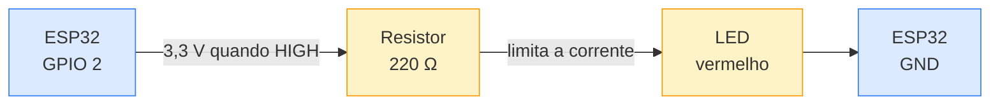

## 1. Objetivo

A atividade pede um *hello world* desenvolvido na plataforma Wokwi, acompanhado de uma
explicação de como esse ambiente de desenvolvimento funciona. Este documento traz o
circuito, o código comentado, o formato da saída no monitor serial e a análise do que a
que ela não permite.

## 2. O que é o Wokwi

O Wokwi é um simulador de sistemas embarcados que roda inteiramente no navegador. Ele não
emula apenas o processador: simula também os componentes ligados a ele — LEDs, sensores,
displays, botões — e a interação elétrica entre eles ao longo do tempo.

Isso resolve o problema mais concreto de quem começa em IoT: **o hardware chega depois da
vontade de programar**. Sem placa, sem sensor e sem protoboard, ainda assim é possível
escrever firmware, ver o LED piscar e ler o monitor serial.

### 2.1. Como o ambiente é organizado

Um projeto no Wokwi é composto por dois arquivos, e entender essa separação é entender a
ferramenta:

| Arquivo | Papel |
|---|---|
| `sketch.ino` | O firmware. Mesmo código C/C++ que seria compilado para a placa real |
| `diagram.json` | O circuito. Descreve as peças, suas posições e cada fio ligando pino a pino |

O `diagram.json` é a diferença em relação a um compilador comum. Ele é o equivalente
textual da protoboard: cada entrada em `parts` é um componente, e cada entrada em
`connections` é um fio, escrito como `[origem, destino, cor, trajeto]`.

```json
"connections": [
  [ "esp:2", "r1:1", "green", [ "v0" ] ],
  [ "r1:2", "led1:A", "green", [ "v0" ] ],
  [ "led1:C", "esp:GND.1", "black", [ "v0" ] ]
]
```

Essas três linhas descrevem o circuito inteiro deste trabalho: o GPIO 2 vai ao resistor, o
resistor vai ao ânodo do LED, e o cátodo volta ao terra. É exatamente a ligação que seria
montada à mão.

## 3. O circuito



O resistor de 220 Ω não é decoração. O GPIO do ESP32 entrega 3,3 V, e um LED vermelho tem
queda de aproximadamente 2 V e suporta cerca de 20 mA. Sem o resistor, a corrente seria
limitada apenas pela resistência interna — o suficiente para queimar o LED, e possivelmente
o pino. Pela lei de Ohm:

```
R = (3,3 V − 2,0 V) / 0,02 A ≈ 65 Ω  (mínimo)
```

Usar 220 Ω dá margem confortável e resulta em cerca de 6 mA, mais que suficiente para o LED
acender bem. O simulador não queima nada, mas o hábito de calcular vem daqui.

## 4. O código

O firmware está em `wokwi/sketch.ino`. Duas decisões merecem explicação.

**Por que `millis()` e não `delay()`.** A forma ingênua de piscar um LED é acender, esperar
um segundo com `delay(1000)`, apagar, esperar de novo. Funciona — e trava o processador
inteiro durante a espera. Nenhum sensor é lido, nenhuma mensagem é enviada, nenhum botão é
detectado. Como todo projeto IoT real precisa fazer várias coisas ao mesmo tempo, o padrão
correto é comparar o relógio:

```cpp
unsigned long agora = millis();

if (agora - ultimaTroca >= INTERVALO) {
  ultimaTroca = agora;
  ligado = !ligado;
  digitalWrite(PINO_LED, ligado ? HIGH : LOW);
}
```

O laço continua livre. É onde entrariam a leitura de um sensor e a publicação MQTT nas
semanas seguintes.

**Por que imprimir dados do chip.** O `setup()` reporta modelo, frequência e memória livre:

```cpp
Serial.print("Chip: ");        Serial.println(ESP.getChipModel());
Serial.print("Frequencia: ");  Serial.println(ESP.getCpuFreqMHz());
Serial.print("Memoria livre: ");Serial.println(ESP.getFreeHeap());
```

Isso transforma o *hello world* num teste de sanidade: se essas linhas aparecem, a placa
inicializou, o clock está configurado e a serial está na taxa certa. Quando o monitor mostra
símbolos sem sentido, quase sempre é porque a taxa do monitor não bate com os 115200 do
`Serial.begin()` — é o primeiro erro que todo mundo comete.

## 5. Formato da saída no monitor serial

O bloco abaixo mostra a **estrutura** que o firmware imprime. Os três valores entre
sinais de menor e maior são lidos do próprio chip em tempo de execução e variam a cada
placa e a cada compilação — por isso aparecem como marcadores, e não como números fixos.

```
=====================================
  Hello, World! - ESP32 no Wokwi
=====================================
Chip: <modelo reportado pelo chip>
Frequencia da CPU: <valor reportado> MHz
Memoria livre: <valor reportado pelo chip> bytes
-------------------------------------
[1s] ciclo 1 | LED ACESO
[2s] ciclo 2 | LED APAGADO
[3s] ciclo 3 | LED ACESO
[4s] ciclo 4 | LED APAGADO
```

## 6. Como reproduzir

1. Abrir <https://wokwi.com> e criar um novo projeto **ESP32**.
2. Colar o conteúdo de `wokwi/sketch.ino` na aba do código.
3. Abrir a aba `diagram.json` e substituir pelo arquivo `wokwi/diagram.json` — o circuito
   aparece montado, sem precisar arrastar componentes.
4. Clicar em **Play**. O LED começa a piscar e o monitor serial exibe a saída acima.

## 7. O que o simulador entrega e o que ele não entrega

| O Wokwi resolve | O Wokwi não resolve |
|---|---|
| Escrever e depurar firmware sem hardware | Ruído elétrico, mau contato, fio solto |
| Compartilhar um projeto por link, já montado | Consumo real de bateria |
| Testar lógica de sensores com valores controlados | Tempo de resposta físico de um sensor |
| Repetir sempre o mesmo cenário | Interferência de RF e alcance de antena |

A coluna da direita é a razão pela qual a simulação não substitui a bancada. Ela é
excelente para **a lógica** e inútil para **a física**. Um código que funciona no Wokwi
pode falhar na placa por um fio mal encaixado — e é justamente esse tipo de falha que o
simulador nunca vai reproduzir.

Comparado ao Tinkercad, o Wokwi tem a vantagem de suportar ESP32 com Wi-Fi simulado e
bibliotecas do Arduino, o que permite chegar até a publicação MQTT sem hardware. O
Tinkercad é mais simples e mais didático para eletrônica básica, mas fica restrito ao
Arduino Uno.

## 8. Conclusão

O *hello world* embarcado cumpre duas funções ao mesmo tempo: confirma que o ambiente está
configurado corretamente e introduz o laço não bloqueante que estrutura todo firmware
sério. O Wokwi torna esse primeiro passo imediato, e a separação entre `sketch.ino` e
`diagram.json` deixa explícito que num sistema embarcado o circuito é parte do programa —
mudar um fio muda o comportamento tanto quanto mudar uma linha de código.

## 9. Referências

- Wokwi — documentação da plataforma. <https://docs.wokwi.com/>
- Wokwi — formato do `diagram.json`. <https://docs.wokwi.com/diagram-format>
- Espressif. *ESP32 Series Datasheet*. <https://www.espressif.com/sites/default/files/documentation/esp32_datasheet_en.pdf>
- Arduino. *Blink Without Delay*. <https://docs.arduino.cc/built-in-examples/digital/BlinkWithoutDelay>
- Material da semana: `week6.pdf` (Módulo 6 — Estruturas e ferramentas de desenvolvimento de IoT).
