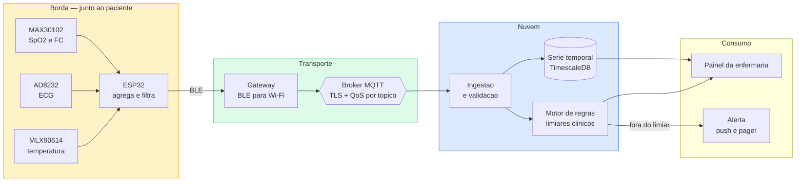

## 1. O problema

A atividade pede o projeto de um sistema IoT para monitorar sinais vitais de pacientes,
descrevendo as tecnologias escolhidas e as funcionalidades que o sistema teria.

Antes de escolher qualquer tecnologia, é preciso reconhecer o que torna este domínio
diferente de um projeto IoT comum. Numa estufa conectada, um dado perdido é um
inconveniente. Aqui, um alerta de arritmia que não chega é um dano ao paciente. Três
consequências decorrem disso e orientam todas as decisões deste documento:

1. **Falha silenciosa é inaceitável.** O sistema precisa saber quando parou de receber
   dados, e avisar. Um gráfico vazio não pode ser confundido com um paciente estável.
2. **Nem todo dado tem a mesma urgência.** A temperatura pode chegar com um minuto de
   atraso; um alarme de parada cardíaca, não.
3. **O dado é sensível por definição.** Dado de saúde é dado pessoal sensível pela LGPD, o
   que impõe criptografia, finalidade declarada e rastreabilidade de acesso.

## 2. Arquitetura proposta



## 3. Tecnologias escolhidas, e por quê

### 3.1. Sensores

| Sinal vital | Sensor | Por que este |
|---|---|---|
| Frequência cardíaca e SpO2 | MAX30102 | Oximetria por fotopletismografia; mede os dois sinais no mesmo módulo, reduzindo pontos de falha |
| Eletrocardiograma | AD8232 | Front-end analógico de ECG de canal único, projetado para sinal cardíaco com ruído de movimento |
| Temperatura corporal | MLX90614 | Infravermelho sem contato — evita irritação de pele em uso contínuo |
| Frequência respiratória | derivada do ECG | Extraída da modulação do sinal, dispensando um quarto sensor |

A última linha é uma decisão de projeto, não uma economia: **quanto menos sensores presos
ao corpo, maior a adesão do paciente**. Derivar a respiração do ECG custa processamento e
poupa um dispositivo.

### 3.2. Microcontrolador

**ESP32.** Traz Wi-Fi e Bluetooth Low Energy no mesmo chip, tem dois núcleos — permitindo
separar a aquisição do sinal da comunicação — e um conversor analógico-digital adequado ao
AD8232. O ponto decisivo é o BLE: um dispositivo preso ao paciente precisa atravessar o
turno inteiro com bateria pequena, e o BLE consome uma fração do Wi-Fi.

### 3.3. Comunicação

**BLE do corpo até o gateway, MQTT do gateway até a nuvem.** A divisão existe porque os
dois trechos têm restrições opostas: perto do paciente a prioridade é bateria; a partir do
gateway, alcance e confiabilidade.

O MQTT foi escolhido em vez de HTTP por três motivos concretos: cabeçalho fixo de 2 bytes
contra centenas do HTTP, o que importa quando se publica a cada segundo por leito; **QoS
por mensagem**, permitindo tratar cada sinal conforme sua criticidade; e o *Last Will and
Testament*, que ataca diretamente o problema da falha silenciosa.

### 3.4. Hierarquia de tópicos e QoS

```
hospital/ala-3/leito-12/vitais/spo2       QoS 0
hospital/ala-3/leito-12/vitais/ecg        QoS 0
hospital/ala-3/leito-12/vitais/temp       QoS 0
hospital/ala-3/leito-12/alerta/critico    QoS 2
hospital/ala-3/leito-12/status/conexao    QoS 1  (retained + LWT)
```

Essa distinção é o coração do projeto:

- **QoS 0 para fluxo contínuo.** SpO2 e ECG chegam várias vezes por segundo; uma amostra
  perdida é irrelevante porque a próxima vem em milissegundos, e a tendência se mantém.
- **QoS 2 para alerta crítico.** Entrega exatamente uma vez. Aqui a duplicação também é
  problema: dois alarmes idênticos mobilizam duas equipes para o mesmo leito.
- **LWT no tópico de status.** Ao conectar, o dispositivo registra no broker uma mensagem
  de "offline" que será publicada automaticamente se a conexão cair sem aviso. É o
  mecanismo que transforma falha silenciosa em alerta — sem ele, um sensor que morre parece
  um paciente sem novidades.

### 3.5. Armazenamento e processamento

**TimescaleDB**, extensão do PostgreSQL para série temporal, guarda o histórico. Os dados
são séries indexadas por tempo, e o banco oferece agregação contínua e política de
retenção: leitura por segundo na última hora, média por minuto no último mês.

**Filtragem na borda, antes de publicar.** O ESP32 calcula média móvel e descarta leituras
fisiologicamente impossíveis — uma SpO2 de 12% é sensor mal posicionado, não hipóxia.
Filtrar na origem reduz tráfego e, sobretudo, evita alarme falso, que é o principal motivo
pelo qual equipes clínicas passam a ignorar alarmes.

## 4. Funcionalidades do sistema

| # | Funcionalidade | Descrição |
|---|---|---|
| 1 | Monitoramento contínuo | FC, SpO2, ECG, temperatura e respiração por leito, em tempo real |
| 2 | Painel da enfermaria | Visão de todos os leitos, ordenada por gravidade e não por número |
| 3 | Alertas por limiar | Faixas configuráveis por paciente — o normal de um cardíaco não é o de um jovem saudável |
| 4 | Detecção de desconexão | LWT e *heartbeat*: sensor mudo vira alerta em até 30 s |
| 5 | Histórico e tendência | Gráficos por período, com marcação dos eventos de alerta |
| 6 | Escalonamento de alerta | Sem reconhecimento em N minutos, o alerta sobe para o plantonista |
| 7 | Relatório de turno | Resumo automático por paciente ao fim de cada turno |
| 8 | Trilha de auditoria | Registro de quem acessou qual prontuário e quando |

A funcionalidade 4 é a que separa um sistema clínico de um painel bonito, e a 6 reconhece
que alertar não é o mesmo que ser atendido.

## 5. Segurança e privacidade

- **TLS em todo o caminho**, MQTT incluído — dado de saúde não trafega em claro.
- **Autenticação por dispositivo**, com certificado individual. Um sensor comprometido é
  revogado sem derrubar a ala inteira.
- **Pseudonimização**: o tópico carrega o leito, nunca o nome. A associação leito-paciente
  fica no banco, com acesso auditado.
- **Retenção definida**, conforme a LGPD: dado de saúde tem prazo e finalidade declarados.
- **Autonomia local**: o gateway mantém alarme sonoro no leito mesmo se a nuvem cair. O
  sistema degrada, mas não emudece.

## 6. Limitações assumidas

Vale registrar o que este projeto **não** é. Ele é um sistema de **monitoramento e alerta**,
não um dispositivo médico certificado — o que exigiria conformidade regulatória (ANVISA,
IEC 62304) e validação clínica. Os sensores citados são de nível educacional: o MAX30102 e
o AD8232 servem para aprender a arquitetura, não para diagnóstico. Num sistema hospitalar
real, o equipamento de leito seria certificado, e a parte IoT seria a camada de integração
e visualização — que é justamente o que este desenho cobre.

## 7. Conclusão

A decisão técnica central deste projeto não foi a escolha do sensor nem do banco, e sim
**tratar os sinais por criticidade em vez de uniformemente**. Um sistema que entrega tudo
com a mesma garantia ou desperdiça recursos com dados descartáveis, ou arrisca perder o
único dado que importava. QoS por tópico, filtragem na borda e *Last Will* são três formas
da mesma ideia: o sistema precisa saber a diferença entre um dado a mais e um alarme.

## 8. Referências

- OASIS. *MQTT Version 5.0 — Quality of Service e Will Message*. <https://docs.oasis-open.org/mqtt/mqtt/v5.0/mqtt-v5.0.html>
- Analog Devices. *MAX30102 Pulse Oximeter and Heart-Rate Sensor*. <https://www.analog.com/en/products/max30102.html>
- Analog Devices. *AD8232 Single-Lead Heart Rate Monitor*. <https://www.analog.com/en/products/ad8232.html>
- Timescale. *TimescaleDB — time-series data in PostgreSQL*. <https://docs.timescale.com/>
- Brasil. *Lei 13.709/2018 (LGPD) — dados pessoais sensíveis, art. 5º, II*. <https://www.planalto.gov.br/ccivil_03/_ato2015-2018/2018/lei/l13709.htm>
- Material da semana: Módulo 7 — Tendências emergentes e direções futuras em IoT.
