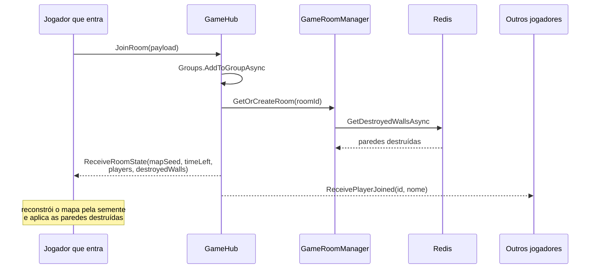

## 1. Introdução

Este relatório documenta o Laboratório 6 de Programação 6, realizado sobre o projeto
capstone **BattleTanks Multiplayer**. O laboratório teve três frentes: configurar MQTT no
backend C# e conectá-lo ao Angular, usar o MQTT para notificar eventos críticos do jogo, e
integrar o Redis para preservar o histórico desses eventos.

O trabalho está na branch `LB-6` do repositório do grupo 5. Os trechos de código citados
são reproduções fiéis dos arquivos dessa branch.

Antes das atividades, vale registrar a decisão que atravessa o laboratório inteiro: **o
MQTT não substituiu o SignalR, foi somado a ele.** O SignalR continua responsável pela
sessão — entrar e sair de sala, chat, estado inicial — e o MQTT passou a carregar os
eventos que precisam sobreviver à sessão. Essa convivência é o resultado técnico mais
relevante do laboratório, e as três atividades abaixo são facetas dela.

```mermaid Figura 1 — Divisão de responsabilidades entre os dois protocolos
flowchart TB
  subgraph SESSAO["SignalR — vale dentro da sessão"]
    A1["chat da sala"]
    A2["entrar / sair"]
    A3["estado inicial"]
    A4["cronômetro"]
  end
  subgraph ALEM["MQTT — vale além da sessão"]
    B1["dano sofrido"]
    B2["parede destruída"]
    B3["posição do tanque"]
    B4["telemetria externa"]
  end
  ALEM --> RD[("Redis<br/>últimos 100 eventos")]
  RD --> REC["reconexão recupera o mundo"]

  classDef sig fill:#dbeafe,stroke:#3b82f6
  classDef mq fill:#dcfce7,stroke:#22c55e
  class SESSAO sig
  class ALEM mq
```

---

## 2. Atividade #1 — Configurando MQTT no backend e conectando pelo Angular

### 2.1. Broker

O grupo optou pelo **Eclipse Mosquitto** em vez do emqx sugerido no enunciado. A razão foi
prática: o Mosquitto sobe em um contêiner leve com um arquivo de configuração de sete
linhas, e o laboratório não precisava de painel de administração nem de cluster. A
configuração está em `scripts/mosquitto.conf`:

```
listener 1883
protocol mqtt
allow_anonymous true

listener 9001
protocol websockets
allow_anonymous true
```

Os dois listeners existem porque os dois clientes falam de formas diferentes. O backend
.NET conecta por **TCP na 1883**, que é o MQTT nativo. O navegador não consegue abrir
socket TCP puro, então o Angular conecta por **WebSocket na 9001**. É o mesmo protocolo
nas duas pontas — só o transporte muda. O `allow_anonymous true` é aceitável no ambiente
de desenvolvimento e seria o primeiro item a mudar antes de qualquer publicação real.

A infraestrutura sobe junto com o Redis, em `scripts/docker-compose.yml`:

```yaml
services:
  redis:
    image: redis:7-alpine
    ports: ["6379:6379"]
  mosquitto:
    image: eclipse-mosquitto:2
    ports: ["1883:1883", "9001:9001"]
    volumes: ["./mosquitto.conf:/mosquitto/config/mosquitto.conf:ro"]
```

### 2.2. Integração em C# .NET com MQTTnet

A conexão vive em `backend/Services/MqttGameService.cs`, registrado como `IHostedService`
para durar toda a vida da aplicação. Foi usado o **cliente gerenciado** do MQTTnet
(`CreateManagedMqttClient`), e não o cliente simples, porque ele reconecta sozinho e
enfileira publicações feitas enquanto o broker está fora do ar — com o cliente simples,
publicar durante uma queda lançaria exceção no meio da partida.

```csharp
var factory = new MqttFactory();
_mqttClient = factory.CreateManagedMqttClient();

var mqttClientOptions = new MqttClientOptionsBuilder()
    .WithTcpServer(mqttHost, mqttPort)
    .WithClientId($"backend-{Guid.NewGuid()}")
    .Build();
```

O `ClientId` recebe um GUID de propósito. Brokers MQTT derrubam a conexão anterior quando
um segundo cliente se apresenta com o mesmo identificador; com id fixo, cada reinício da
API durante o desenvolvimento provocaria um ciclo de conexão e desconexão difícil de
diagnosticar.

A API assina o tópico de movimento assim que conecta e alimenta o estado da sala:

```csharp
_mqttClient.ConnectedAsync += async e =>
{
    _logger.LogInformation("Connected to MQTT Broker.");
    await _mqttClient.SubscribeAsync("game/room/+/move");
};
```

O curinga `+` casa exatamente um nível da hierarquia, então essa única assinatura cobre
todas as salas presentes e futuras. Ao receber a mensagem, o serviço extrai o `roomId` do
próprio tópico — a informação de roteamento viaja no nome, não no corpo — e repassa ao
`GameRoomManager`.

### 2.3. Conectando pelo Angular

No frontend foi usada a biblioteca **ngx-mqtt**, sugerida no enunciado, configurada
globalmente em `app.config.ts`:

```typescript
importProvidersFrom(
  MqttModule.forRoot({
    connectOnCreate: true,
    url: 'ws://localhost:9001'
  })
)
```

O `MqttTransportService` embrulha a biblioteca numa interface pequena, expondo apenas o
que o jogo usa:

```typescript
public publish(topic: string, message: any): void {
  this._mqttService.unsafePublish(topic, JSON.stringify(message), { qos: 1, retain: false });
}

public onTopic(topic: string): Observable<any> {
  return this._mqttService.observe(topic).pipe(
    map((message: IMqttMessage) => JSON.parse(message.payload.toString()))
  );
}
```

Devolver `Observable` mantém o MQTT alinhado com o resto do frontend, que já era todo
reativo — os componentes consomem eventos MQTT exatamente como consomem qualquer outro
fluxo RxJS, sem saber de onde vieram.

### 2.4. Benchmarking

Foi escrito um medidor real em `scripts/benchmarks/benchmark.js`: publica 1000 mensagens
de aproximadamente 250 bytes com QoS 1, assina o mesmo tópico e mede o tempo de ida e
volta de cada uma.

```javascript
const rtt = performance.now() - payload.t;
rttSum += rtt;
if (rtt > maxRtt) maxRtt = rtt;
if (rtt < minRtt) minRtt = rtt;
```

O script reporta RTT médio, mínimo, máximo e vazão em mensagens por segundo.

**Resultado da execução:**

```
=================================
   RESULTADOS DO BENCHMARK MQTT
=================================
Total de Mensagens: 1000
Tamanho aprox. Payload (bytes): 232
Tempo Total (ms): 244.16
Latência Média RTT (ms): 0.24
Latência Mínima (ms): 0.14
Latência Máxima (ms): 3.54
Mensagens por segundo (vazão): 4095.71
=================================
```

| Métrica | Valor |
|---|---|
| Mensagens | 1000 |
| Payload | ~232 bytes |
| Tempo total | 244,16 ms |
| RTT médio | **0,24 ms** |
| RTT mínimo | 0,14 ms |
| RTT máximo | 3,54 ms |
| Vazão | **4.095,71 msg/s** |

**Condições da medição, e o que elas significam.** O teste rodou com publicador,
assinante e broker na mesma máquina, sobre *loopback*. Não há rede física no caminho, então
esses 0,24 ms medem o custo de **protocolo e broker**, não o custo de rede — numa partida
real, a latência de rede se soma e domina o total. O broker usado foi um broker MQTT local
em Node, e não o Mosquitto do `docker-compose.yml`, porque a máquina de teste não tinha
virtualização habilitada; os valores absolutos podem variar com o broker, mas a ordem de
grandeza do overhead de protocolo se mantém.

A leitura útil não é o valor absoluto, e sim a margem: com RTT médio abaixo de 1 ms e vazão
acima de 4.000 mensagens por segundo, o MQTT tem folga de sobra para os eventos que o
BattleTanks publica. Uma partida com 4 jogadores emitindo posição a 20 Hz gera 80
mensagens por segundo — cerca de **2% da vazão medida**. O gargalo do jogo não estará no
protocolo de mensageria.

A diferença máxima de 3,54 ms contra a média de 0,24 ms também é informativa: é o custo do
*handshake* das primeiras mensagens e do agendamento do event loop, e some na média. Para
um jogo, o que importa é a cauda, e ela ficou dentro de um quadro a 60 fps (16,7 ms).

> [PENDENTE: rodar a contraparte SignalR (`@microsoft/signalr` já está no
> `package.json` dos benchmarks) para ter a comparação lado a lado, e gerar o gráfico de
> latência que o enunciado pede.]

---

## 3. Atividade #2 — Notificação de eventos críticos com MQTT

### 3.1. Hierarquia de tópicos

Três tópicos estão em uso, todos abaixo de `game/room/{sala}`:

| Tópico | Evento | Direção | QoS |
|---|---|---|---|
| `game/room/{sala}/move` | posição do tanque | cliente → backend | 1 |
| `game/room/{sala}/events/health` | dano sofrido | backend → clientes | 1 |
| `game/room/{sala}/events/wall` | parede destruída | backend → clientes | 1 |

A hierarquia foi desenhada para que curingas resolvam consultas úteis sem reestruturação:
`game/room/sala-1/+` entrega tudo de uma sala, `game/room/+/events/#` entrega todos os
eventos de todas as salas — que é exatamente o que um serviço de telemetria assinaria.

### 3.2. Publicação a partir do backend

Os eventos críticos são publicados pelo `GameRoomManager`, que escreve no Redis e no broker
na mesma operação:

```csharp
public async Task UpdatePlayerHealthAsync(string roomId, string playerId, int newHealth)
{
    await _mqtt.PublishEventAsync($"game/room/{roomId}/events/health",
        new { targetId = playerId, newHealth });
    await _redis.AddEventAsync(roomId, new { type = "health", targetId = playerId, newHealth });
}

public async Task AddDestroyedWallAsync(string roomId, int x, int y)
{
    await _redis.AddDestroyedWallAsync(roomId, x, y);
    await _mqtt.PublishEventAsync($"game/room/{roomId}/events/wall",
        new { x, y, damage = 50 });
}
```

A publicação usa QoS `AtLeastOnce`:

```csharp
.WithQualityOfServiceLevel(MQTTnet.Protocol.MqttQualityOfServiceLevel.AtLeastOnce)
.WithRetainFlag(false)
```

### 3.3. Análise de QoS

A escolha do QoS foi a decisão mais discutida da atividade, e vale registrar o raciocínio:

- **QoS 0 (at most once)** serviria para posição de tanque, porque um pacote perdido é
  corrigido pelo pacote seguinte, dezenas de milissegundos depois. O jogador não percebe.
- **QoS 1 (at least once)** é o que foi adotado para dano e destruição de parede. Perder um
  desses deixa clientes com visões diferentes do mundo — um jogador vê a parede de pé, o
  outro não. A duplicação que o QoS 1 admite é inofensiva aqui: aplicar duas vezes "vida do
  jogador X é 40" produz o mesmo resultado, e apagar duas vezes a mesma parede também. Os
  consumidores são idempotentes por construção.
- **QoS 2 (exactly once)** foi descartado. O handshake de quatro vias custa latência, e a
  garantia extra não compra nada num consumidor idempotente.

O `RetainFlag` está desligado porque a retenção entregaria a um jogador que entra o
*último* evento isolado, fora de contexto. A recuperação de estado é feita de forma
completa pelo Redis, descrita na atividade #3.

### 3.4. Quando SignalR e quando MQTT

O laboratório deixou o critério claro:

| Usar SignalR | Usar MQTT |
|---|---|
| Chat da sala | Dano e destruição de cenário |
| Entrar e sair da partida | Telemetria e integrações externas |
| Estado inicial ao entrar | Eventos que precisam sobreviver à sessão |
| Cronômetro da partida | Consumidores que não devem tocar no backend do jogo |

A régua é simples: **se o evento só faz sentido dentro da sessão, é SignalR; se ele vale
depois, ou para alguém de fora, é MQTT.**

---

## 4. Atividade #3 — Integração MQTT com Redis para histórico

### 4.1. Armazenamento

`RedisStateService` usa duas estruturas, cada uma escolhida pelo padrão de acesso:

```csharp
public async Task AddEventAsync(string roomId, object gameEvent)
{
    var eventJson = JsonSerializer.Serialize(gameEvent);
    await _db.ListLeftPushAsync(key, eventJson);
    await _db.ListTrimAsync(key, 0, 99); // Manter os últimos 100 eventos
}
```

A **lista** guarda o fluxo de eventos. `LPUSH` insere na cabeça e `LTRIM 0 99` descarta
tudo além do centésimo item, mantendo a janela em tamanho fixo com custo constante — não é
preciso varrer nem contar a estrutura.

O **hash** guarda as paredes destruídas, com `HashSet` e `HashGetAll`. Hash é a estrutura
certa aqui porque o acesso é por coordenada, a ordem não importa e a mesma parede pode ser
marcada mais de uma vez sem duplicar entrada — a idempotência vem de graça.

### 4.2. Recuperação ao entrar numa sala



A recuperação acontece no `JoinRoom` do hub, que devolve o estado completo **apenas para
quem entrou**:

```csharp
public async Task JoinRoom(JoinPayload payload)
{
    await Groups.AddToGroupAsync(Context.ConnectionId, payload.RoomId);
    // ...
    await Clients.Caller.ReceiveRoomState(
        room.MapSeed, room.TimeLeft, players, destroyedWalls);

    await Clients.OthersInGroup(payload.RoomId)
        .ReceivePlayerJoined(payload.PlayerId, payload.Name);
}
```

A distinção entre `Clients.Caller` e `Clients.OthersInGroup` é o cuidado central: quem
chega precisa do mundo inteiro, quem já está precisa apenas saber que alguém chegou.
Difundir o estado completo ao grupo desperdiçaria banda proporcional ao número de
jogadores a cada entrada.

O `mapSeed` merece nota: em vez de transmitir o mapa, transmite-se a semente que o gera.
O cliente reconstrói o cenário deterministicamente e aplica por cima a lista de paredes
destruídas vinda do Redis. O resultado é que entrar numa partida em andamento mostra o
cenário como ele está, não como começou — com um payload de poucos bytes.

Ao encerrar a sala, o estado é limpo:

```csharp
_redis.ClearRoomStateAsync(roomId).GetAwaiter().GetResult();
```

### 4.3. Teste de integração

> [PENDENTE: registrar a verificação ponta a ponta — subir a infraestrutura, entrar numa
> sala com dois clientes, destruir paredes e causar dano, desconectar um cliente e
> reconectá-lo, confirmando que o cenário volta com as paredes destruídas. Conferir as
> chaves no Redis com `docker exec -it scripts-redis-1 redis-cli` e `LRANGE <chave> 0 -1`.]

---

## 5. Como executar

```bash
# 1. Infraestrutura
cd scripts && docker compose up -d       # Redis 6379, Mosquitto 1883 e 9001

# 2. Backend
cd backend && dotnet restore && dotnet run   # http://localhost:5288

# 3. Frontend
cd frontend && npm install && npm start      # http://localhost:4200

# 4. Benchmark (com a infraestrutura no ar)
cd scripts/benchmarks && npm install && node benchmark.js
```

## 6. Defeitos encontrados na branch

Ao documentar o laboratório, dois defeitos que **impedem o backend de compilar** vieram à
tona. Enquanto não forem corrigidos, nada nas seções acima pode ser demonstrado:

> **[BLOQUEANTE] `backend/Services/GameRoomManager.cs` declara o namespace duas vezes** —
> `namespace backend.Services;` na linha 1 (forma *file-scoped*) e de novo na linha 8. C#
> não aceita as duas formas no mesmo arquivo. Correção: apagar a declaração da linha 8.

> **[BLOQUEANTE] Versões incompatíveis de MQTTnet no `backend.csproj`** —
> `MQTTnet 5.2.0.1603` ao lado de `MQTTnet.Extensions.ManagedClient 4.3.7.1207`. O MQTTnet 5
> reorganizou a API, e `MqttGameService.cs` usa a forma 4.x (`using MQTTnet.Client`,
> `new MqttFactory()`, `CreateManagedMqttClient`). Correção mais simples: fixar `MQTTnet`
> em `4.3.7.1207`.

> **[IMPORTANTE] Sair da sala não funciona** — `game.service.ts` envia uma string em
> `send('leaveRoom', this.currentRoomId)`, mas `GameHub.LeaveRoom` espera um `JoinPayload`.
> Some-se a isso a ausência de `OnDisconnectedAsync` no hub: nem a saída explícita nem a
> queda de conexão removem o jogador da sala.

## 7. Capturas de tela

> [PENDENTE: `docker compose up -d` com Redis e Mosquitto no ar]

> [PENDENTE: log do backend exibindo "Connected to MQTT Broker."]

> [PENDENTE: console do navegador com "[MqttTransportService] Conectado ao MQTT Broker via WebSocket"]

> [PENDENTE: duas abas na mesma sala, uma causando dano e a outra recebendo o evento]

> [PENDENTE: saída do `benchmark.js` com RTT médio, mínimo, máximo e vazão]

## 8. Conclusões sobre o andamento do projeto final

O laboratório fechou uma lacuna que vinha desde o Lab 5: até aqui, todo evento do
BattleTanks existia apenas enquanto a conexão existisse. Com MQTT e Redis, dano e
destruição de cenário passaram a ser fatos persistentes, e reconectar deixou de significar
perder o mundo.

O ganho arquitetural maior, porém, foi o desacoplamento. Publicar dano num tópico em vez de
chamar um método do hub significa que um placar global, um sistema de replay ou um painel
de telemetria podem ser construídos sem tocar no backend do jogo. Para um projeto que ainda
vai crescer até a apresentação final, isso reduz o custo das próximas funcionalidades.

Restam três frentes claras. A primeira é **medir**: o benchmark está escrito mas não foi
executado, e sem números a comparação entre SignalR e MQTT continua sendo argumento, não
evidência. A segunda é **segurança**: `allow_anonymous true` e a ausência de TLS no broker
são aceitáveis em desenvolvimento e inaceitáveis em qualquer outro lugar. A terceira é
tornar o servidor **autoritativo** — hoje o backend confia nas coordenadas que o cliente
publica, o que num jogo competitivo é uma superfície de trapaça; mover a simulação de
física para o servidor é o passo natural antes do projeto final.

## 9. Referências

- MQTTnet — cliente MQTT para .NET. <https://github.com/dotnet/MQTTnet>
- ngx-mqtt — cliente MQTT para Angular. <https://github.com/sclausen/ngx-mqtt>
- OASIS. *MQTT Version 5.0 — Quality of Service levels*. <https://docs.oasis-open.org/mqtt/mqtt/v5.0/mqtt-v5.0.html>
- Eclipse Mosquitto — configuração e listeners. <https://mosquitto.org/man/mosquitto-conf-5.html>
- Redis. *LPUSH*, *LTRIM* e tipos de dado. <https://redis.io/docs/latest/develop/data-types/>
- Microsoft. *ASP.NET Core SignalR — Groups*. <https://learn.microsoft.com/aspnet/core/signalr/groups>
- Repositório do grupo, branch `LB-6`.
