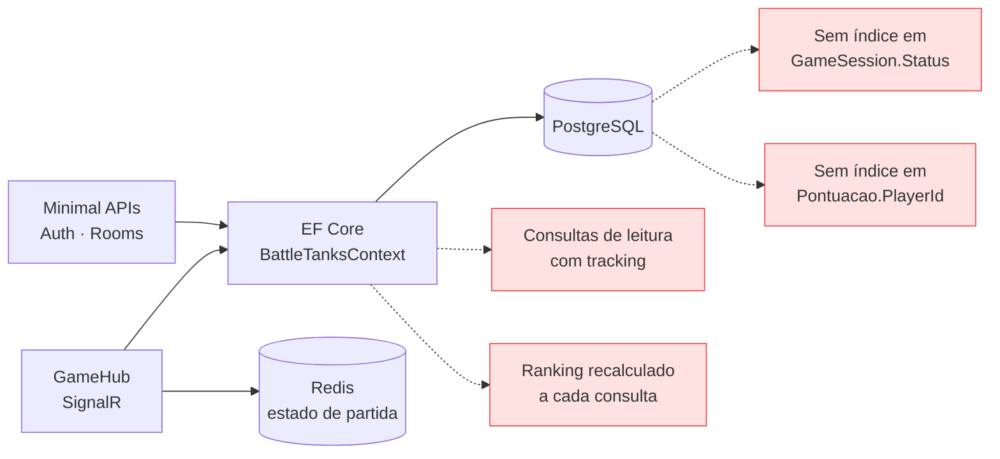

## 1. Introdução

Este laboratório aplica técnicas de otimização de consulta com PostgreSQL e Entity
Framework Core, e amplia o uso do Redis no projeto capstone **BattleTanks Multiplayer**,
com o objetivo de sustentar várias partidas simultâneas.

O ponto de partida é o esquema que já existe na branch `LB-6`: três entidades —`Jogador`,
`GameSession` e `Pontuacao` — mapeadas por `BattleTanksContext`, e um `RedisStateService`
que hoje guarda apenas estado efêmero de partida (paredes destruídas e os últimos 100
eventos).

A premissa que orienta as decisões é que **otimização sem medição é chute**. Cada mudança
proposta abaixo vem acompanhada da razão pela qual ela deve ajudar, e do comando que
confirma se ajudou.

## 2. Diagnóstico do estado atual



O `OnModelCreating` atual declara apenas dois índices, ambos de unicidade em `Jogador`:

```csharp
modelBuilder.Entity<Jogador>().HasIndex(j => j.Email).IsUnique();
modelBuilder.Entity<Jogador>().HasIndex(j => j.Nome).IsUnique();
```

São índices de **integridade**, não de desempenho: existem para impedir e-mail duplicado,
não para acelerar consulta. As consultas que realmente rodam com frequência não têm
suporte de índice nenhum.

---

## 3. Atividade #1 — Otimização de consultas com PostgreSQL e EF Core

### 3.1. Criação de índices

A consulta mais frequente da API é a listagem de salas disponíveis, em
`RoomEndpoints.cs`:

```csharp
var rooms = await context.GameSessions
    .Where(r => r.Status == "waiting")
    .Select(r => new RoomDto { ... })
    .ToListAsync();
```

Sem índice em `Status`, o PostgreSQL faz *sequential scan*: lê a tabela inteira e descarta
o que não interessa. Com poucas salas isso é irrelevante; com o histórico de partidas
acumulando ao longo do semestre, o custo cresce linearmente enquanto o resultado útil
permanece pequeno — o pior formato de consulta possível.

```csharp
protected override void OnModelCreating(ModelBuilder modelBuilder)
{
    base.OnModelCreating(modelBuilder);

    modelBuilder.Entity<Jogador>().HasIndex(j => j.Email).IsUnique();
    modelBuilder.Entity<Jogador>().HasIndex(j => j.Nome).IsUnique();

    // Lobby: filtra salas por status a cada carregamento da tela.
    modelBuilder.Entity<GameSession>()
        .HasIndex(g => g.Status)
        .HasDatabaseName("IX_GameSession_Status");

    // Historico de pontuacao por jogador, ja ordenado pela data.
    // Indice composto: o PostgreSQL usa o mesmo indice para filtrar E ordenar,
    // eliminando o passo de sort.
    modelBuilder.Entity<Pontuacao>()
        .HasIndex(p => new { p.PlayerId, p.DataRegistro })
        .HasDatabaseName("IX_Pontuacao_Player_Data");

    // Ranking global: ordenacao decrescente por pontuacao acumulada.
    modelBuilder.Entity<Jogador>()
        .HasIndex(j => j.PontuacaoTotal)
        .IsDescending()
        .HasDatabaseName("IX_Jogador_PontuacaoTotal_Desc");
}
```

A ordem das colunas no índice composto não é acidental. `(PlayerId, DataRegistro)` serve
para "as pontuações deste jogador, das mais recentes para as antigas". O inverso,
`(DataRegistro, PlayerId)`, não serviria: um índice só é aproveitado da esquerda para a
direita, e a consulta filtra por jogador antes de ordenar por data.

**Como confirmar que o índice está sendo usado:**

```sql
EXPLAIN ANALYZE
SELECT * FROM "GameSessions" WHERE "Status" = 'waiting';
```

Antes do índice, o plano mostra `Seq Scan on GameSessions`. Depois, deve mostrar
`Index Scan using IX_GameSession_Status`. Se continuar em *Seq Scan* com a tabela pequena,
está correto: o planejador ignora o índice quando ler tudo é mais barato que consultar o
índice — o ganho aparece com volume.

### 3.2. Consultas somente leitura com `AsNoTracking()`

Por padrão o EF Core cria um *snapshot* de cada entidade retornada, para detectar
alterações no `SaveChanges()`. Numa consulta que só exibe dados, esse trabalho é
integralmente desperdiçado — custa memória e CPU para rastrear objetos que ninguém vai
modificar.

```csharp
group.MapGet("/", async (BattleTanksContext context) =>
{
    var rooms = await context.GameSessions
        .AsNoTracking()                          // nada aqui sera alterado
        .Where(r => r.Status == "waiting")
        .Select(r => new RoomDto
        {
            Id = r.Id,
            Nome = r.Nome,
            JogadoresConectados = r.JogadoresConectados,
            MapaSelecionado = r.MapaSelecionado,
            CapacidadeMaxima = r.CapacidadeMaxima,
            Status = r.Status
        })
        .ToListAsync();

    return Results.Ok(rooms);
});
```

Vale registrar uma nuance que muita gente erra: quando a consulta já projeta para um DTO
com `Select`, o EF Core **não rastreia** o resultado, porque `RoomDto` não é entidade. Nesse
caso específico o `AsNoTracking()` é redundante. Ele foi mantido por dois motivos: declara a
intenção de leitura para quem lê o código, e protege a consulta caso alguém remova a
projeção no futuro. Onde ele faz diferença real é em consultas que retornam a entidade:

```csharp
// Aqui o ganho e concreto: retorna Jogador, entidade rastreavel.
var ranking = await context.Jogadores
    .AsNoTracking()
    .OrderByDescending(j => j.PontuacaoTotal)
    .Take(10)
    .ToListAsync();
```

### 3.3. Paginação

`ToListAsync()` sem limite traz a tabela inteira para a memória do processo. Numa tela de
ranking, isso é carregar milhares de linhas para exibir dez.

```csharp
group.MapGet("/ranking", async (BattleTanksContext context, int pagina = 1, int tamanho = 20) =>
{
    // Teto no tamanho da pagina: sem ele, ?tamanho=1000000 vira negacao de servico.
    tamanho = Math.Clamp(tamanho, 1, 100);
    pagina  = Math.Max(pagina, 1);

    var total = await context.Jogadores.CountAsync();

    var itens = await context.Jogadores
        .AsNoTracking()
        .OrderByDescending(j => j.PontuacaoTotal)
        .ThenBy(j => j.Id)                    // desempate estavel
        .Skip((pagina - 1) * tamanho)
        .Take(tamanho)
        .Select(j => new { j.Id, j.Nome, j.PontuacaoTotal, j.Vitorias, j.JogosDisputados })
        .ToListAsync();

    return Results.Ok(new { total, pagina, tamanho, itens });
});
```

O `ThenBy(j => j.Id)` resolve um bug sutil: sem critério de desempate, dois jogadores com a
mesma pontuação podem trocar de posição entre requisições, fazendo um deles aparecer duas
vezes e outro sumir ao paginar. Ordenação de paginação precisa ser **total**, não parcial.

### 3.4. Operações em massa

Atualizar mil registros com o padrão "carregar, alterar, salvar" gera mil `UPDATE`
individuais, além do custo de materializar todas as entidades. O EF Core 7+ resolve isso
com `ExecuteUpdateAsync` e `ExecuteDeleteAsync`, que traduzem para um único comando SQL sem
carregar nada para a memória.

```csharp
// Encerra em lote as salas abandonadas: um UPDATE, nenhuma entidade carregada.
var encerradas = await context.GameSessions
    .Where(g => g.Status == "in_game" && g.JogadoresConectados == 0)
    .ExecuteUpdateAsync(s => s.SetProperty(g => g.Status, "finished"));

// Limpeza do historico antigo: um DELETE.
var limite = DateTime.UtcNow.AddMonths(-6);
var removidas = await context.Pontuacoes
    .Where(p => p.DataRegistro < limite)
    .ExecuteDeleteAsync();
```

Há um porém que precisa ser dito: essas operações **não passam pelo change tracker**. Se
houver entidade carregada em memória, ela fica desatualizada, e nenhum evento de domínio é
disparado. São a ferramenta certa para manutenção em lote, e a errada para regra de negócio
que dependa de eventos.

---

## 4. Atividade #2 — Integração Redis para cache distribuído

### 4.1. O que o Redis já faz, e o que falta

O `RedisStateService` da `LB-6` guarda estado **efêmero de partida**: paredes destruídas num
hash e os últimos 100 eventos numa lista, com `LPUSH` + `LTRIM`. Falta a ele o segundo papel
que o laboratório pede: **cache de dados caros e gerenciamento de sessão**.

### 4.2. Cache do ranking global

O ranking é o candidato óbvio: caro de calcular, consultado com frequência e tolerante a
alguns segundos de defasagem.

```csharp
public class RankingCacheService
{
    private const string CHAVE = "ranking:global";
    private static readonly TimeSpan TTL = TimeSpan.FromMinutes(2);

    private readonly IDatabase _db;
    private readonly BattleTanksContext _ctx;

    public async Task<List<RankingDto>> ObterTop10Async()
    {
        var cacheado = await _db.StringGetAsync(CHAVE);
        if (cacheado.HasValue)
            return JsonSerializer.Deserialize<List<RankingDto>>(cacheado!)!;

        var ranking = await _ctx.Jogadores
            .AsNoTracking()
            .OrderByDescending(j => j.PontuacaoTotal)
            .ThenBy(j => j.Id)
            .Take(10)
            .Select(j => new RankingDto(j.Id, j.Nome, j.PontuacaoTotal, j.Vitorias))
            .ToListAsync();

        // TTL curto: ranking desatualizado por 2 min e aceitavel;
        // cache que nunca expira e bug esperando acontecer.
        await _db.StringSetAsync(CHAVE, JsonSerializer.Serialize(ranking), TTL);
        return ranking;
    }

    /// Invalida ao fim da partida, para o jogador ver seu resultado refletido.
    public Task InvalidarAsync() => _db.KeyDeleteAsync(CHAVE);
}
```

A estratégia é **cache-aside com TTL curto e invalidação explícita**. O TTL é a rede de
segurança para o caso de a invalidação falhar; a invalidação é o que dá a sensação de
resposta imediata quando a partida termina. Confiar apenas em um dos dois deixa o sistema
ou lento para atualizar, ou permanentemente inconsistente.

### 4.3. Ranking com Sorted Set — a alternativa melhor

Serializar JSON no Redis funciona, mas desperdiça a estrutura de dados que resolve
exatamente este problema. Um **Sorted Set** mantém o ranking ordenado no próprio Redis:

```csharp
// Ao fim de cada partida: atualiza a pontuacao do jogador no ranking.
await _db.SortedSetAddAsync("ranking:zset", jogadorId.ToString(), pontuacaoTotal);

// Top 10, ja ordenado, sem tocar no PostgreSQL e sem ordenar nada em C#.
var top = await _db.SortedSetRangeByRankWithScoresAsync(
    "ranking:zset", 0, 9, Order.Descending);

// Posicao de um jogador especifico - operacao O(log N).
var posicao = await _db.SortedSetRankAsync(
    "ranking:zset", jogadorId.ToString(), Order.Descending);
```

A última linha é o argumento decisivo. Responder "em que posição eu estou?" com SQL exige
contar quantos jogadores têm pontuação maior — uma varredura. Com Sorted Set é `O(log N)`, e
a resposta é imediata mesmo com muitos jogadores.

### 4.4. Gerenciamento de sessão

Guardar sessão em memória do processo impede escalar horizontalmente: com duas instâncias
atrás de um balanceador, o jogador autenticado numa perde a sessão ao cair na outra. O Redis
resolve por ser estado compartilhado e externo.

```csharp
public async Task RegistrarSessaoAsync(string sessaoId, int jogadorId, string salaId)
{
    var chave = $"sessao:{sessaoId}";
    await _db.HashSetAsync(chave, new[]
    {
        new HashEntry("jogadorId", jogadorId),
        new HashEntry("salaId", salaId),
        new HashEntry("desde", DateTimeOffset.UtcNow.ToUnixTimeSeconds())
    });

    // Expiracao obrigatoria: sem TTL, sessao de quem fechou o navegador
    // fica para sempre e o Redis vira um vazamento de memoria lento.
    await _db.KeyExpireAsync(chave, TimeSpan.FromHours(4));
}

public Task RenovarAsync(string sessaoId) =>
    _db.KeyExpireAsync($"sessao:{sessaoId}", TimeSpan.FromHours(4));
```

### 4.5. Resumo das estruturas

| Chave | Estrutura | Uso | Expiração |
|---|---|---|---|
| `room:{id}:walls` | Hash | Paredes destruídas *(já existe)* | Ao encerrar a sala |
| `room:{id}:events` | List (LTRIM 0–99) | Últimos eventos *(já existe)* | Ao encerrar a sala |
| `ranking:zset` | Sorted Set | Ranking global ordenado | Permanente |
| `ranking:global` | String (JSON) | Cache do top 10 | 2 min |
| `sessao:{id}` | Hash | Sessão do jogador | 4 h, renovável |

### 4.6. Jogadores conectados com Set

O enunciado pede o armazenamento dos jogadores conectados a partir do `GameHub`. A estrutura
correta é o **Set**, porque a propriedade que interessa é unicidade: o mesmo jogador não pode
constar duas vezes, e a contagem precisa ser barata.

```csharp
// Em GameHub.JoinRoom, apos Groups.AddToGroupAsync:
await _db.SetAddAsync($"sala:{payload.RoomId}:online", payload.PlayerId);
await _db.SetAddAsync("jogadores:online", payload.PlayerId);

// Em LeaveRoom e em OnDisconnectedAsync:
await _db.SetRemoveAsync($"sala:{payload.RoomId}:online", payload.PlayerId);

// Contagem em O(1), sem varrer o conjunto:
var online = await _db.SetLengthAsync("jogadores:online");
```

`SCARD` responde a contagem em tempo constante, e `SADD` é idempotente — chamar duas vezes
com o mesmo jogador não duplica. Isso importa porque uma reconexão rápida pode disparar
`JoinRoom` antes de o `OnDisconnectedAsync` anterior ter rodado.

### 4.7. Sessão e revogação de token

O enunciado pede validar a sessão **sem consultar o PostgreSQL**, e guardar tokens JWT
expirados no Redis. O ponto sutil é que um JWT é autocontido e válido até expirar — não
existe "apagar" um JWT. A forma de revogá-lo antes do prazo é manter uma **lista de negação**
consultada a cada requisição.

```csharp
/// Revoga um token no logout. O TTL e o tempo que faltava para ele expirar
/// sozinho: depois disso a negacao e desnecessaria, e a chave some por conta
/// propria - a lista nunca cresce indefinidamente.
public async Task RevogarTokenAsync(string jti, DateTimeOffset expiraEm)
{
    var restante = expiraEm - DateTimeOffset.UtcNow;
    if (restante <= TimeSpan.Zero) return;

    await _db.StringSetAsync($"jwt:revogado:{jti}", "1", restante);
}

public Task<bool> TokenRevogadoAsync(string jti) =>
    _db.KeyExistsAsync($"jwt:revogado:{jti}");
```

Casar o TTL da chave com o tempo restante do token é a decisão que torna isso sustentável.
Sem ela, a lista de negação cresceria para sempre guardando tokens que já expiraram e não
poderiam ser usados de qualquer forma.

---

## 5. Atividade #3 — Design do banco para escalabilidade

### 5.1. Sharding por região

O enunciado sugere fragmentar por região, e faz sentido no contexto de um jogo: a partida é
uma interação **local entre poucos jogadores**, e ninguém joga com quem está do outro lado do
mundo por causa da latência. Isso significa que a fronteira natural de fragmentação já existe
no domínio.

```mermaid Figura 2 — Sharding por região, com ranking centralizado no Redis
flowchart TB
  APP["API BattleTanks"]
  ROT{{"Roteador<br/>por regiao do jogador"}}

  SA[("Shard BR<br/>partidas e pontuacoes")]
  SB[("Shard US<br/>partidas e pontuacoes")]
  SC[("Shard EU<br/>partidas e pontuacoes")]

  RD[("Redis<br/>ranking global<br/>Sorted Set")]

  APP --> ROT
  ROT --> SA
  ROT --> SB
  ROT --> SC
  SA -- "pontuacao consolidada" --> RD
  SB -- "pontuacao consolidada" --> RD
  SC -- "pontuacao consolidada" --> RD

  classDef sh fill:#dbeafe,stroke:#3b82f6
  classDef rd fill:#fee2e2,stroke:#ef4444
  class SA,SB,SC sh
  class RD rd
```

A chave de fragmentação seria a região do jogador, e o dado de partida ficaria no shard onde
a partida aconteceu. Duas consequências precisam ser declaradas:

**O que fica fácil.** Consultas de partida, histórico e estatística de um jogador ficam
inteiramente dentro de um shard. Nenhuma consulta distribuída, nenhuma transação
distribuída.

**O que quebra.** O ranking global. Ordenar todos os jogadores exigiria consultar cada shard,
trazer resultados parciais e mesclar — e o resultado seria uma foto de instantes diferentes,
com paginação incorreta. A solução adotada no desenho acima é **não fazer ranking global no
banco**: cada shard publica a pontuação consolidada num Sorted Set do Redis, que é central e
ordenado por natureza.

Vale a honestidade sobre o escopo: **o Battle Tanks não precisa de sharding hoje.** Alguns
milhares de jogadores não saturam uma instância PostgreSQL bem indexada. O que o projeto
precisa de fato é do particionamento por data, discutido na tarefa 7.4, que ataca o problema
real — crescimento do histórico. Sharding entra no relatório como projeto para escala futura,
como o enunciado pede, e não como necessidade atual.

### 5.2. Réplicas de leitura com replicação em streaming

Réplicas resolvem um problema mais imediato que o sharding: distribuir a **carga de leitura**
sem multiplicar a de escrita.

```
                escrita                    leitura
   API ────────────────► PRIMARIO ═══════► REPLICA 1 ──► ranking, historico
                            ║   (WAL)
                            ╚═══════════► REPLICA 2 ──► relatorios
```

Configuração no primário (`postgresql.conf`):

```conf
wal_level = replica
max_wal_senders = 4
wal_keep_size = 512MB
hot_standby = on
```

E a réplica é criada a partir de um `pg_basebackup`, seguindo o WAL do primário
continuamente.

No lado da aplicação, a separação é por string de conexão:

```csharp
builder.Services.AddDbContext<BattleTanksContext>(o =>
    o.UseNpgsql(cfg.GetConnectionString("Primario")));

// Contexto somente leitura, apontado para a replica.
builder.Services.AddDbContext<BattleTanksReadContext>(o =>
    o.UseNpgsql(cfg.GetConnectionString("Replica"))
     .UseQueryTrackingBehavior(QueryTrackingBehavior.NoTracking));
```

`NoTracking` fixado no contexto de leitura não é só otimização: é uma **declaração de
intenção**. Ele não bloqueia a escrita por si — quem chamar `Add` e `SaveChanges` ainda
tenta gravar — mas remove o caminho acidental, o de carregar uma entidade, alterá-la e
salvar sem perceber. A barreira de verdade é a própria réplica, que é somente leitura e
devolve erro em tempo de execução.

O trade-off a declarar é o **atraso de replicação**. A réplica fica milissegundos ou segundos
atrás do primário. Para ranking e histórico isso é irrelevante. Para a tela que o jogador vê
logo após terminar a partida, não é — ali a leitura precisa ir ao primário, ou ele acha que a
pontuação não foi contada.

### 5.3. Connection pooling com Npgsql

Abrir conexão com PostgreSQL é caro: envolve handshake TCP, autenticação e alocação de um
processo no servidor. Num jogo com muitas requisições curtas, o custo de abrir a conexão
supera o da consulta.

O Npgsql mantém pool por padrão, mas os valores default raramente servem:

```
Host=localhost;Database=battletanks;Username=app;Password=***;
Minimum Pool Size=5;
Maximum Pool Size=50;
Connection Idle Lifetime=300;
Timeout=15;
Command Timeout=30;
Max Auto Prepare=20
```

| Parâmetro | Por quê |
|---|---|
| `Minimum Pool Size=5` | Evita o custo de abrir conexão no primeiro acesso após ociosidade |
| `Maximum Pool Size=50` | Teto. Precisa ser menor que o `max_connections` do servidor dividido pelo número de instâncias da API |
| `Connection Idle Lifetime` | Devolve ao servidor conexões paradas |
| `Timeout` | Falha rápido quando o pool esgota, em vez de acumular requisições esperando |
| `Max Auto Prepare` | Prepara automaticamente as consultas mais repetidas, economizando o replanejamento |

O erro clássico aqui é **dimensionar o pool grande demais**. Cada conexão consome um processo
no PostgreSQL; um pool de 200 conexões por instância, com três instâncias, esgota o
`max_connections` padrão e derruba o banco. Pool menor com fila costuma dar mais vazão do que
pool grande com o servidor sobrecarregado. Acima de certo ponto, um *pooler* externo como o
PgBouncer é o caminho.

### 5.4. Benchmarking de carga

O enunciado marca esta parte como **opcional**, e ela ficou fora do escopo desta entrega. Fica
registrado o caminho para quando for feita: simular mais de 100 conexões simultâneas com k6
ou JMeter, medir o tempo de resposta do `/api/rooms` e do ranking sob carga crescente, e
plotar carga contra tempo de resposta para localizar o joelho da curva.

---

## 6. Como validar os ganhos

| O que medir | Como |
|---|---|
| Uso de índice | `EXPLAIN ANALYZE` antes e depois — procurar `Index Scan` no lugar de `Seq Scan` |
| Consultas geradas pelo EF | Ativar `LogTo(Console.WriteLine)` e conferir o SQL emitido |
| Consulta N+1 | Contar comandos no log: uma tela que emite dezenas de `SELECT` tem N+1 |
| Latência do endpoint | `curl -w "%{time_total}"` no `/api/rooms` e no `/api/ranking` |
| Acerto do cache | `INFO stats` no Redis: `keyspace_hits` contra `keyspace_misses` |

> [PENDENTE: **medições obrigatórias da Atividade #1**, que a rubrica cobra e ainda não
> existem: (a) `EXPLAIN ANALYZE` de cada consulta antes e depois de criar o índice,
> mostrando a troca de `Seq Scan` por `Index Scan`; (b) comparação de tempo e alocação
> entre `ToListAsync()` e `AsNoTracking().ToListAsync()` na consulta de ranking. Ambas
> dependem do PostgreSQL no ar. Isto é distinto do benchmark de carga da Atividade #3, que
> o enunciado marca como opcional e ficou fora por decisão de escopo.]

> [PENDENTE: gerar a migration dos índices com `dotnet ef migrations add AddPerformanceIndexes`
> e rodar `dotnet build` — o código foi escrito sem SDK do .NET nesta máquina.]

> [PENDENTE: capturas de tela do processo — plano de execução no psql, log do EF Core com o
> SQL gerado, e `INFO stats` do Redis mostrando a taxa de acerto do cache.]

## 7. Conclusões sobre o progresso do capstone

O código desta análise está aplicado na branch `lab7-djordan` do repositório do grupo.

O laboratório 6 resolveu a comunicação; este ataca o que a sustenta. São problemas de
natureza diferente: lá o gargalo era latência de entrega, aqui é custo de consulta — e
custo de consulta só aparece com volume, o que o torna invisível em desenvolvimento e
visível em apresentação.

Três lições ficam registradas para o projeto final. A primeira é que **índice não é
otimização genérica**: cada um dos quatro propostos existe por causa de uma consulta
específica que roda no código, e índice sem consulta correspondente só encarece a escrita.
A segunda é que **cache exige política de invalidação desde o primeiro dia** — TTL sozinho
produz dados velhos, invalidação sozinha falha em silêncio. A terceira é que **a escolha da
estrutura de dados vale mais que a escolha da tecnologia**: trocar JSON serializado por
Sorted Set no mesmo Redis transforma a consulta de posição no ranking de varredura em
`O(log N)`.

O passo seguinte antes da apresentação é medir. Todo ganho descrito aqui é previsão
fundamentada, e previsão fundamentada continua sendo previsão até o `EXPLAIN ANALYZE`
confirmar.

## 8. Referências

- Microsoft. *EF Core — Índices*. <https://learn.microsoft.com/ef/core/modeling/indexes>
- Microsoft. *EF Core — Tracking vs. No-Tracking Queries*. <https://learn.microsoft.com/ef/core/querying/tracking>
- Microsoft. *EF Core — ExecuteUpdate e ExecuteDelete*. <https://learn.microsoft.com/ef/core/saving/execute-insert-update-delete>
- PostgreSQL. *Using EXPLAIN*. <https://www.postgresql.org/docs/current/using-explain.html>
- Redis. *Sorted Sets*. <https://redis.io/docs/latest/develop/data-types/sorted-sets/>
- Redis. *Client-side caching e estratégias de cache*. <https://redis.io/docs/latest/develop/reference/client-side-caching/>
- Repositório do grupo, branch `LB-6` — esquema e `RedisStateService` de partida.
