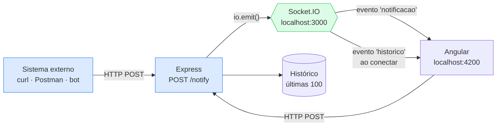
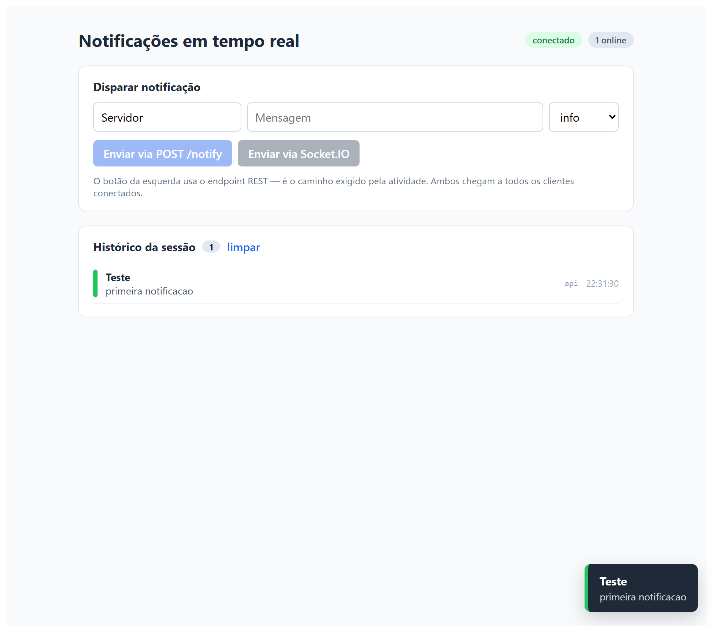
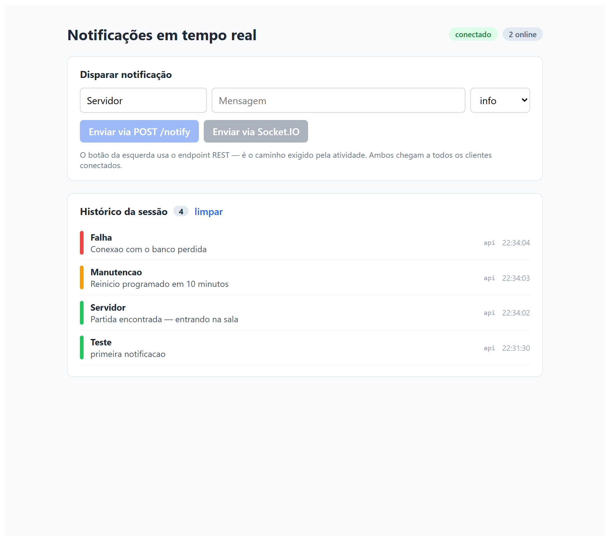
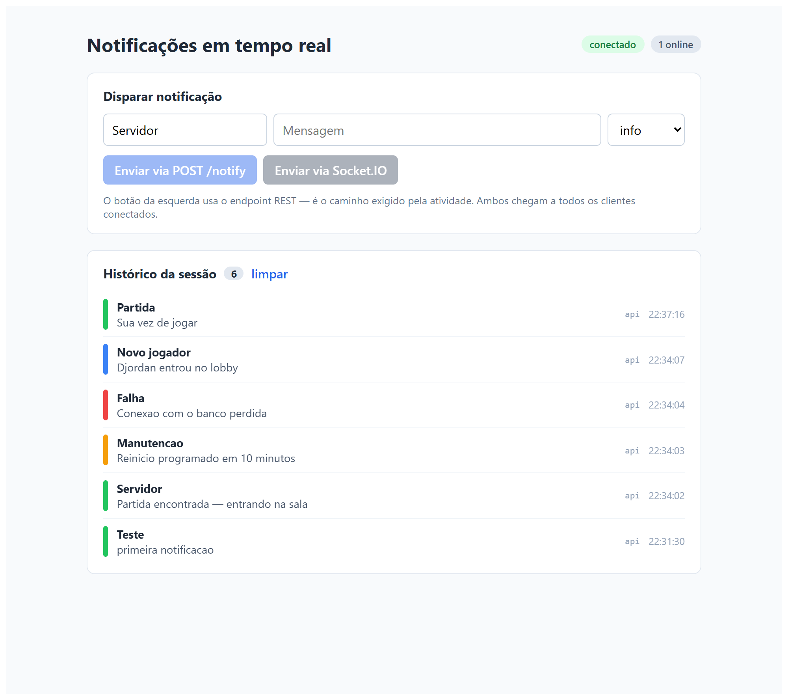
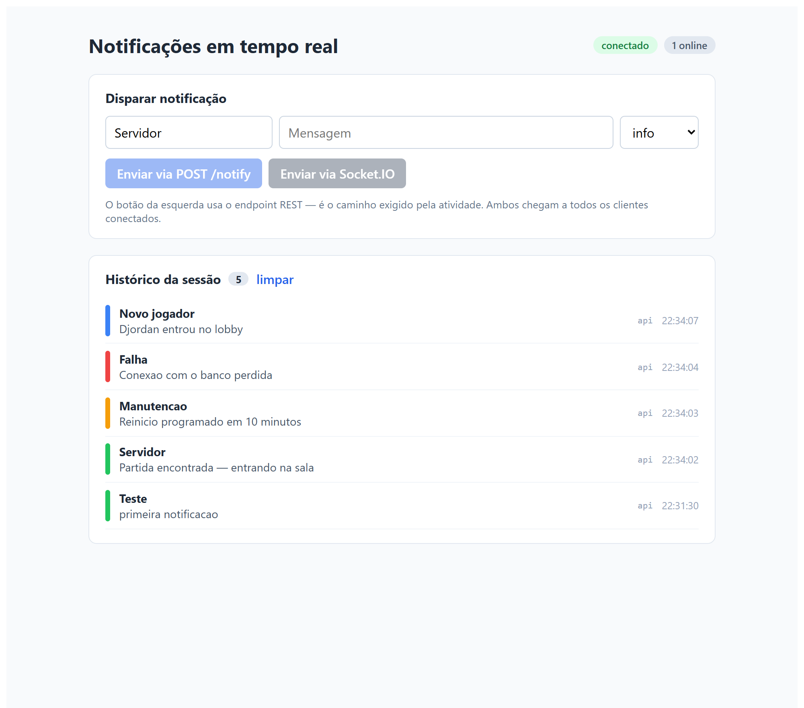

## 1. Introdução

Esta entrega implementa uma aplicação de notificações em tempo real: um servidor Node.js
que aceita disparos por HTTP e os retransmite instantaneamente a todos os clientes
conectados, e um cliente Angular que exibe cada notificação como item de lista e como
*toast*, mantendo o histórico da sessão.

O objetivo por trás do exercício é comparar dois modelos de comunicação. No HTTP
tradicional o cliente pergunta e o servidor responde; para saber de algo novo, ele precisa
perguntar de novo. Com WebSockets a conexão fica aberta e o servidor avisa quando quiser.
A aplicação foi construída justamente para tornar essa diferença visível.

Conforme o enunciado, o complemento opcional em C#/SignalR não foi implementado — o
projeto principal é o de Node.js.

## 2. Arquitetura



A separação central é essa: **o REST é o caminho de escrita e o WebSocket é o de leitura.**
Quem dispara uma notificação não precisa manter conexão aberta — basta um `POST`. Quem
consome não precisa perguntar nada — recebe quando o evento acontece. Os dois caminhos se
encontram no `io.emit()`.

### 2.1. Estrutura de arquivos

```
backend/
├── package.json          express, socket.io, cors
└── server.js             REST + Socket.IO + histórico em memória

frontend/
├── package.json          Angular 19 + socket.io-client
└── src/app/
    ├── notificacoes.service.ts   conexão, signals e disparo
    ├── app.component.ts          estado da tela e do toast
    ├── app.component.html        formulário, lista e toast
    └── app.component.css

capturas/                 evidências do fluxo em execução
```

## 3. Backend — Express e Socket.IO

O servidor HTTP e o servidor WebSocket compartilham a mesma porta, porque o Socket.IO se
acopla ao servidor HTTP do Node em vez de abrir outra escuta:

```javascript
const app = express();
const servidor = http.createServer(app);

const io = new Server(servidor, {
  cors: { origin: ORIGEM_FRONTEND, methods: ['GET', 'POST'] },
});
```

O CORS precisa ser declarado nos dois lugares — no Express, para o `POST /notify`, e no
Socket.IO, para o *handshake* da conexão. Configurar só um dos dois é o erro mais comum
aqui: o `POST` funciona e a conexão em tempo real falha silenciosamente.

### 3.1. O endpoint de disparo

```javascript
app.post('/notify', (req, res) => {
  const { titulo, mensagem, nivel } = req.body || {};

  if (!mensagem || typeof mensagem !== 'string' || !mensagem.trim()) {
    return res.status(400).json({ erro: "O campo 'mensagem' e obrigatorio." });
  }

  const notificacao = registrar(criarNotificacao({ ... }));
  io.emit('notificacao', notificacao);

  return res.status(202).json({ entregue: true, clientes: io.engine.clientsCount, notificacao });
});
```

Duas escolhas deliberadas. O status é **202 Accepted**, e não 200: o servidor confirma que
aceitou e difundiu, mas não tem como garantir que cada cliente processou. E a resposta
devolve `clientes`, o número de conexões que receberam — é o que permite verificar a
entrega sem abrir o navegador, e foi assim que as capturas da seção 6 foram conferidas.

### 3.2. Conexão e desconexão

```javascript
io.on('connection', (socket) => {
  conectados.set(socket.id, { id: socket.id, conectadoEm: new Date().toISOString() });

  // Quem entra recebe o histórico de uma vez.
  socket.emit('historico', historico);

  socket.broadcast.emit('presenca', { tipo: 'entrada', clienteId: socket.id, online: conectados.size });
  io.emit('online', conectados.size);

  socket.on('disconnect', (motivo) => {
    conectados.delete(socket.id);
    socket.broadcast.emit('presenca', { tipo: 'saida', clienteId: socket.id, online: conectados.size });
    io.emit('online', conectados.size);
  });
});
```

A distinção entre `socket.emit`, `socket.broadcast.emit` e `io.emit` é o que dá controle
sobre o destinatário: o primeiro fala só com quem acabou de conectar, o segundo com todos
os outros, e o terceiro com todo mundo. Enviar o histórico apenas ao recém-chegado evita
que quem já está na tela receba de novo uma lista que já tem.

## 4. Frontend — Angular

O componente não conversa com o `socket.io-client`: consome *signals* do serviço.

```typescript
this.socket.on('historico', (itens: Notificacao[]) =>
  this.notificacoes.set(Array.isArray(itens) ? itens : [])
);

this.socket.on('notificacao', (n: Notificacao) =>
  this.notificacoes.update((lista) => [n, ...lista].slice(0, 100))
);
```

O `.slice(0, 100)` limita a janela: numa sessão longa a lista cresceria sem parar e o
`*ngFor` passaria a custar caro a cada evento recebido.

O disparo pelo REST usa `fetch`, e não o socket, porque é esse o caminho que a atividade
exige demonstrar:

```typescript
async publicarViaRest(titulo: string, mensagem: string, nivel: Nivel): Promise<void> {
  const resposta = await fetch(`${URL_SERVIDOR}/notify`, {
    method: 'POST',
    headers: { 'Content-Type': 'application/json' },
    body: JSON.stringify({ titulo, mensagem, nivel }),
  });
  ...
}
```

A tela mostra as notificações das duas formas pedidas: **lista** com histórico e nível
codificado por cor, e **toast** no canto inferior direito para a mais recente.

## 5. Como executar

**Backend**

```bash
cd backend
npm install
npm start          # http://localhost:3000
```

**Frontend**

```bash
cd frontend
npm install
npm start          # http://localhost:4200
```

**Disparar uma notificação**

```bash
curl -X POST http://localhost:3000/notify \
     -H "Content-Type: application/json" \
     -d '{"titulo":"Servidor","mensagem":"Partida encontrada","nivel":"sucesso"}'
```

Resposta:

```json
{"entregue":true,"clientes":2,"notificacao":{"id":2,"titulo":"Servidor", ... }}
```

Rotas auxiliares: `GET /health` (status e número de conexões) e `GET /notifications`
(histórico da sessão).

## 6. Capturas do fluxo em execução










As figuras 3 e 4 são o núcleo da demonstração: duas abas independentes, nenhuma delas
recarregada, exibindo os mesmos três eventos na mesma ordem, disparados de fora por
`curl`. A resposta do `POST` registrou `"clientes":2`, confirmando pelo lado do servidor a
mesma entrega que as telas mostram.

## 7. Reflexão técnica

**WebSockets e HTTP.** O HTTP é um protocolo de requisição e resposta: o cliente pergunta,
o servidor responde, a conexão se encerra. Para descobrir se algo mudou, o cliente precisa
perguntar de novo — daí o *polling*, que gasta banda perguntando quando nada aconteceu e
ainda assim entrega a novidade com atraso. O WebSocket inverte isso. Começa como uma
requisição HTTP comum com o cabeçalho `Upgrade`, e a partir do aceite o mesmo socket TCP
passa a transportar quadros nos dois sentidos, sem novo cabeçalho a cada mensagem. A
diferença prática aparece no custo: um cabeçalho HTTP típico ocupa centenas de bytes,
enquanto um quadro WebSocket tem 2 a 14 bytes de overhead. Para notificações pequenas e
frequentes, é a diferença entre viável e desperdício.

**Escalabilidade.** O ganho tem contrapartida. Requisições HTTP são sem estado e qualquer
instância atende qualquer requisição; conexões WebSocket são *stateful* e ficam presas ao
processo que as aceitou. Isso cria três problemas. O primeiro é memória: cada conexão
aberta consome recursos mesmo ociosa, e milhares delas somam. O segundo é o balanceamento:
com várias instâncias atrás de um balanceador, um `io.emit()` só alcança os clientes
daquele processo — resolver exige um adaptador compartilhado, como o de Redis do
Socket.IO, para propagar o evento entre instâncias. O terceiro é a reimplantação: derrubar
um processo desconecta todos os seus clientes de uma vez, e todos tentam reconectar juntos.

**Socket.IO e WebSockets puros.** A API nativa entrega o canal e nada mais. O Socket.IO
acrescenta o que quase todo projeto acabaria escrevendo à mão: reconexão automática com
recuo progressivo, *fallback* para HTTP long-polling onde o WebSocket é bloqueado,
*heartbeat* para detectar conexões mortas que o TCP ainda considera vivas, e eventos
nomeados com confirmação, em vez de um único fluxo de mensagens que a aplicação precisa
rotear sozinha. Recursos como salas e `broadcast` — usados aqui para separar quem acabou de
entrar dos demais — também viriam do zero. O custo é uma biblioteca dos dois lados e um
protocolo próprio sobre o WebSocket, o que impede falar com um servidor WebSocket genérico.
Para esta aplicação a troca compensou.

*(347 palavras)*

## 8. Referências

- Socket.IO — documentação oficial. <https://socket.io/docs/v4/>
- MDN. *The WebSocket API*. <https://developer.mozilla.org/docs/Web/API/WebSockets_API>
- RFC 6455 — The WebSocket Protocol. <https://datatracker.ietf.org/doc/html/rfc6455>
- Express. <https://expressjs.com/>
- Angular. *Signals*. <https://angular.dev/guide/signals>
- Socket.IO. *Adapter de Redis para múltiplas instâncias*. <https://socket.io/docs/v4/redis-adapter/>
