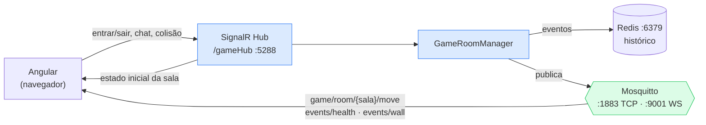

## 1. Introdução

Este documento descreve a camada de comunicação em tempo real do **BattleTanks
Multiplayer**, projeto capstone do grupo 5, e justifica as decisões de protocolo tomadas
pela equipe. O jogo é um multijogador 2D em que cada cliente precisa enxergar posição dos
tanques, disparos, dano e destruição de cenário com latência baixa o suficiente para uma
partida fluida.

O trabalho descrito está na branch `LB-6` do repositório do grupo e foi desenvolvido de
forma colaborativa. Os trechos de código citados são reproduções fiéis dos arquivos dessa
branch.

## 2. Arquitetura: SignalR e MQTT lado a lado

A decisão central do grupo não foi escolher *entre* SignalR e MQTT, e sim **usar os dois,
cada um onde rende mais**. O SignalR é o transporte principal da sessão; o MQTT carrega os
eventos de estado que interessam além da sessão; o Redis guarda o histórico para quem
chega depois.



O cliente mantém **duas conexões simultâneas**: uma com o hub e outra com o broker. Em
`game.service.ts`, ao entrar numa sala pelo SignalR, o serviço assina os três tópicos MQTT
daquela sala:

```typescript
public joinHubRoom(payload: any): void {
  this.currentRoomId = payload.roomId || payload;
  this.activeTransport.send('joinRoom', payload);

  if (this.activeTransport instanceof SignalRTransportService) {
    this.mqttSubscriptions.push(
      this.mqttTransport.onTopic(`game/room/${this.currentRoomId}/move`)
        .subscribe(msg => this.mqttPlayerMove$.next(msg))
    );
    this.mqttSubscriptions.push(
      this.mqttTransport.onTopic(`game/room/${this.currentRoomId}/events/health`)
        .subscribe(msg => this.mqttPlayerHealth$.next(msg))
    );
    this.mqttSubscriptions.push(
      this.mqttTransport.onTopic(`game/room/${this.currentRoomId}/events/wall`)
        .subscribe(msg => this.mqttWallDamaged$.next(msg))
    );
  }
}
```

## 3. Backend — API conectada ao broker MQTT

A conexão com o broker vive em `MqttGameService`, registrado como `IHostedService` para
existir durante toda a vida da aplicação. Usa o **cliente gerenciado** do MQTTnet, que
reconecta sozinho e enfileira publicações feitas enquanto o broker está fora:

```csharp
var factory = new MqttFactory();
_mqttClient = factory.CreateManagedMqttClient();

var mqttClientOptions = new MqttClientOptionsBuilder()
    .WithTcpServer(mqttHost, mqttPort)
    .WithClientId($"backend-{Guid.NewGuid()}")
    .Build();
```

O `ClientId` recebe um GUID porque brokers derrubam a conexão anterior quando dois
clientes se apresentam com o mesmo identificador — com id fixo, reiniciar a API durante o
desenvolvimento provocaria um ciclo de desconexões difícil de diagnosticar.

A API **assina** o tópico de movimento e alimenta o estado da sala:

```csharp
_mqttClient.ConnectedAsync += async e =>
{
    _logger.LogInformation("Connected to MQTT Broker.");
    await _mqttClient.SubscribeAsync("game/room/+/move");
};
```

O curinga `+` casa exatamente um nível, então a assinatura cobre todas as salas sem
precisar reassinar a cada sala criada. Ao receber, o serviço extrai o `roomId` do próprio
tópico e repassa ao `GameRoomManager`.

E **publica** com garantia de entrega:

```csharp
var message = new MqttApplicationMessageBuilder()
    .WithTopic(topic)
    .WithPayload(messagePayload)
    .WithQualityOfServiceLevel(MQTTnet.Protocol.MqttQualityOfServiceLevel.AtLeastOnce)
    .WithRetainFlag(false)
    .Build();
```

`AtLeastOnce` (QoS 1) é a escolha correta para dano e destruição de parede: são eventos
que mudam o estado do jogo, e perder um deixa clientes divergentes. Não se usou QoS 2
porque o consumidor é idempotente — aplicar duas vezes "vida do jogador X = 40" dá o mesmo
resultado.

### 3.1. Endpoints REST

O backend expõe Minimal APIs em `backend/Endpoints/`:

| Método | Rota | Função |
|---|---|---|
| POST | `/api/auth/register` | Cadastro de jogador |
| POST | `/api/auth/login` | Autenticação e emissão de token |
| GET | `/api/rooms` | Lista as salas disponíveis |
| POST | `/api/rooms` | Cria uma sala |

A divisão segue o critério que orientou toda a arquitetura: **o que é requisição-resposta
fica no REST; o que é notificação fica no tempo real.** Autenticar e listar salas são
perguntas com resposta. Movimento e dano são avisos.

## 4. Gerenciamento de conexões e eventos

O `GameHub` não difunde mais para todos os conectados — trabalha com **grupos por sala**:

```csharp
public async Task JoinRoom(JoinPayload payload)
{
    await Groups.AddToGroupAsync(Context.ConnectionId, payload.RoomId);
    // ...
    await Clients.Caller.ReceiveRoomState(
        room.MapSeed, room.TimeLeft, players, destroyedWalls);

    await Clients.OthersInGroup(payload.RoomId)
        .ReceivePlayerJoined(payload.PlayerId, payload.Name);
}

public async Task LeaveRoom(JoinPayload payload)
{
    await Groups.RemoveFromGroupAsync(Context.ConnectionId, payload.RoomId);
    await Clients.OthersInGroup(payload.RoomId).ReceivePlayerLeft(payload.PlayerId);
}
```

Duas decisões merecem destaque:

- **`Clients.Caller` vs `Clients.OthersInGroup`.** Quem entra recebe o estado completo da
  sala; os demais recebem apenas o aviso de que alguém entrou. Evita retransmitir o mapa
  inteiro para quem já o tem.
- **Reconstrução do estado.** `ReceiveRoomState` devolve `mapSeed`, `timeLeft`, jogadores e
  paredes destruídas. É o que permite entrar numa partida em andamento e ver o cenário como
  ele está, não como começou.

O `GameRoomManager` mantém um `Timer` por sala e transmite o cronômetro ao grupo:

```csharp
await _hubContext.Clients.Group(roomId).ReceiveTimeLeft(room.TimeLeft);
```

Como `GameRoomManager` injeta `IHubContext<GameHub, IGameClient>`, a **capacidade** de
empurrar notificação a partir de fora do hub já existe: qualquer ponto do backend pode
chamá-lo. Registre-se, porém, que **nenhum endpoint HTTP exerce essa capacidade hoje** —
as rotas em `Endpoints/` cobrem autenticação e salas, e nenhuma dispara notificação. A
lógica de pontuação da atividade cobra esse item explicitamente; ele está listado na seção
10 como pendência.

## 5. Histórico de notificações com Redis

`RedisStateService` guarda os eventos recentes numa lista limitada:

```csharp
await _db.ListLeftPushAsync(key, eventJson);
await _db.ListTrimAsync(key, 0, 99); // Manter os últimos 100 eventos
```

O par `LPUSH` + `LTRIM` mantém a lista com custo constante: insere na cabeça e descarta a
cauda além do centésimo item, sem varrer a estrutura. As paredes destruídas ficam num hash
(`HashSet`/`HashGetAll`), estrutura adequada porque o acesso é por coordenada e a ordem não
importa.

Assim o histórico sobrevive ao ciclo de vida da conexão: um jogador que cai e volta não
depende de outro cliente lhe contar o que aconteceu.

Uma ressalva de escopo: esse histórico é **de backend**. Ele reidrata o estado do jogo
(paredes destruídas, vida, cronômetro), mas o enunciado também pede *"mostrar o histórico
de notificações durante a sessão"* na interface — uma lista visível de eventos recebidos.
Os dados para isso já existem (`GetRecentEventsAsync` devolve os últimos 100 eventos), mas
nenhum componente Angular os exibe. Consta na seção 10.

## 6. Em que situações o MQTT é necessário no capstone

A atividade pede essa análise explicitamente. Os três casos em que o grupo concluiu que o
MQTT rende mais que o SignalR:

1. **Eventos de estado persistente** — dano e destruição de parede. Combinados com o Redis,
   permitem reconstruir a partida para quem chega depois. É o que já está implementado em
   `events/health` e `events/wall`.
2. **Integrações externas e telemetria.** Um serviço de estatísticas poderia assinar
   `game/room/+/events/#` e agregar resultados sem que uma linha do backend do jogo mudasse.
   Com SignalR, todo consumidor novo exige alteração no hub.
3. **Escala horizontal com muitas salas.** Publicar uma vez num tópico e deixar o broker
   distribuir custa menos ao servidor do que difundir para N conexões em cada instância.

O ponto comum é o **desacoplamento**: no SignalR o servidor precisa conhecer seus clientes;
no MQTT, produtor e consumidor só precisam concordar no nome do tópico.

Em contrapartida, chat e entrada/saída de sala continuam no SignalR, porque ali a sessão
*é* o contexto — e o RPC tipado do hub evita o trabalho de serializar e rotear à mão.

## 7. Justificativa da escolha do protocolo

| Critério | WebSockets puros | MQTT | SignalR | Socket.IO |
|---|---|---|---|---|
| Camada | Transporte TCP full-duplex | Pub/Sub sobre TCP | Abstração RPC | Abstração sobre WS/HTTP |
| Fallback automático | Não | Não | Sim (WS → SSE → Long Polling) | Sim |
| Gestão de conexão | Manual | QoS 0, 1, 2 | Automática | Automática |
| Suporte em C# .NET | Nativo | Bibliotecas externas | Nativo e integrado | Limitado (foco Node.js) |
| Papel no BattleTanks | Não usado | Eventos de estado | Sessão e sala | Não usado |

O SignalR ficou com a sessão por ser nativo do .NET 8, oferecer RPC com tipagem forte — o
que transforma erro de contrato em erro de compilação — e trazer reconexão e fallback
prontos. O MQTT entrou onde o desacoplamento e o QoS por mensagem valem mais que a
conveniência do RPC.

## 8. Estrutura do repositório e execução

Repositório do grupo 5, branch `LB-6`:
<https://gitlab.com/jala-university1/cohort-3/PT.CSPR-364.GA.T2.26.M1/SA/grupo-5/capstone>

```
backend/
├── Hubs/            GameHub.cs, IGameClient.cs
├── Endpoints/       AuthEndpoints.cs, RoomEndpoints.cs   (Minimal APIs)
├── Services/        MqttGameService.cs, RedisStateService.cs, GameRoomManager.cs
└── Program.cs       DI + MapHub<GameHub>("/gameHub")

frontend/src/app/
├── services/transport/   SignalR, WebSocket, Mock e MQTT (ngx-mqtt)
├── services/systems/     physics, input, camera, bot-ai
└── store/                PlayersStore, MapStore, GameStore

scripts/
├── docker-compose.yml    Redis 7 + Mosquitto 2
├── mosquitto.conf        listener 1883 (mqtt) e 9001 (websockets)
└── benchmarks/           benchmark.js
```

**1. Infraestrutura**

```bash
cd scripts
docker compose up -d      # Redis em 6379, Mosquitto em 1883 e 9001
```

**2. Backend**

```bash
cd backend
dotnet restore
dotnet run                # http://localhost:5288 — hub em /gameHub
```

**3. Frontend**

```bash
cd frontend
npm install
npm start                 # http://localhost:4200
```

O Angular já sobe conectado ao broker: `MqttModule.forRoot({ connectOnCreate: true,
url: 'ws://localhost:9001' })` em `app.config.ts`. O navegador não fala MQTT sobre TCP
puro, por isso o broker expõe o listener WebSocket na 9001 — mesmo protocolo, transporte
diferente.

## 9. Reflexão técnica

**Diferenças em relação aos WebSockets.** Um WebSocket é um transporte: entrega um canal
bidirecional entre dois pontos e nada mais. Quem define formato das mensagens, quem recebe
cada uma e o que acontece se o destinatário estiver offline é a aplicação. O SignalR opera
acima disso — negocia o melhor transporte disponível, cuida da reconexão e oferece chamada
de método remota tipada. O MQTT também opera acima, mas noutra direção: é mensageria
publish/subscribe, em que o produtor publica num tópico sem saber quem escuta e o broker
resolve o roteamento. O acoplamento se inverte: com SignalR o servidor mantém a lista de
conexões e decide para quem reenviar; com MQTT ninguém precisa conhecer ninguém, só o nome
do tópico.

Isso aparece no BattleTanks. Adicionar um consumidor de eventos de dano hoje não exige
tocar no `GameHub`: basta assinar `game/room/+/events/health`. Já um recurso novo de chat
passa necessariamente pelo hub.

**Escalabilidade e desempenho.** Três pontos pesaram. O primeiro é o *fan-out*: com
SignalR, transmitir para N jogadores custa N envios ao processo do servidor, e escalar
horizontalmente exige um backplane, normalmente Redis, para sincronizar instâncias. Com
MQTT o broker já é esse ponto central projetado para distribuir, e o publicador emite uma
vez só. O segundo é o *overhead por mensagem*: o cabeçalho fixo do MQTT ocupa 2 bytes,
contra o envelope de invocação de método do SignalR. Numa partida que emite dezenas de
eventos por segundo, isso muda o consumo de banda, sobretudo em rede móvel. O terceiro é o
*QoS por mensagem*: o MQTT deixa escolher a garantia evento a evento. Movimento poderia ir
como QoS 0, porque um pacote perdido é corrigido pelo seguinte; dano e destruição de parede
vão como QoS 1, porque perder um deixa o estado inconsistente. Com WebSocket puro essa
distinção teria de ser implementada à mão, com confirmação e retransmissão próprias.

A conclusão é que os dois convivem por desenho, e não por indecisão: SignalR onde a sessão
é o contexto, MQTT onde o evento vale além dela.

## 10. Defeitos encontrados e pendências

Ao documentar a branch, três defeitos vieram à tona. Os dois primeiros impedem o backend
de compilar, então precisam ser corrigidos antes de qualquer demonstração:

> **[BLOQUEANTE] `backend/Services/GameRoomManager.cs` declara o namespace duas vezes** —
> `namespace backend.Services;` aparece na linha 1 (forma *file-scoped*) e outra vez na
> linha 8. C# não aceita as duas formas no mesmo arquivo; o projeto não compila. Correção:
> remover a declaração da linha 8 e manter os `using` acima dela.

> **[BLOQUEANTE] Versões incompatíveis de MQTTnet no `backend.csproj`** —
> `MQTTnet 5.2.0.1603` convive com `MQTTnet.Extensions.ManagedClient 4.3.7.1207`. A linha 5
> do MQTTnet reorganizou a API, e `MqttGameService.cs` usa a forma 4.x (`using
> MQTTnet.Client`, `new MqttFactory()`, `CreateManagedMqttClient`). Correção mais simples:
> fixar `MQTTnet` em `4.3.7.1207`, igualando ao pacote do ManagedClient.

> **[IMPORTANTE] Sair da sala não funciona** — `game.service.ts` faz
> `this.activeTransport.send('leaveRoom', this.currentRoomId)`, enviando uma *string*,
> enquanto `GameHub.LeaveRoom` espera um `JoinPayload`. O `RoomId` e o `PlayerId` chegam
> nulos, então o jogador não é removido do grupo nem da sala. Correção: enviar
> `{ roomId, playerId }`. Vale notar que também não há `OnDisconnectedAsync` no hub, então
> uma queda de conexão não limpa o jogador — só a saída explícita, hoje quebrada, tentaria.

Pendências de evidência e escopo:

> [PENDENTE: expor um endpoint HTTP que dispare notificação via `IHubContext` — item
> explícito da lógica de pontuação (ver seção 4).]

> [PENDENTE: exibir na UI o histórico de notificações da sessão, consumindo
> `GetRecentEventsAsync` (ver seção 5).]

> [PENDENTE: capturas do fluxo funcionando — `docker compose up` com Redis e Mosquitto no
> ar, o log do backend com "Connected to MQTT Broker.", o console do navegador com
> "[MqttTransportService] Conectado ao MQTT Broker via WebSocket", e duas abas recebendo o
> mesmo evento de dano.]

> [PENDENTE: resultados do benchmark. O script `scripts/benchmarks/benchmark.js` está
> pronto e mede RTT médio, mínimo, máximo e vazão sobre 1000 mensagens, mas **nenhum
> resultado foi registrado no repositório**. Rodar com o broker no ar
> (`node scripts/benchmarks/benchmark.js`) e colar a saída aqui.]

## 11. Referências

- MQTTnet — cliente MQTT para .NET. <https://github.com/dotnet/MQTTnet>
- ngx-mqtt — cliente MQTT para Angular. <https://github.com/sclausen/ngx-mqtt>
- OASIS. *MQTT Version 5.0*. <https://docs.oasis-open.org/mqtt/mqtt/v5.0/mqtt-v5.0.html>
- Microsoft. *Overview of ASP.NET Core SignalR*. <https://learn.microsoft.com/aspnet/core/signalr/introduction>
- Redis. *LPUSH / LTRIM*. <https://redis.io/docs/latest/commands/ltrim/>
- Eclipse Mosquitto. <https://mosquitto.org/documentation/>
- Repositório do grupo, branch `LB-6`.
